# Phase 0 — Environment Setup
### Building the 3-VM SOC Lab: Kali + ELK SIEM + Metasploitable2

## Goal

By the end of this phase you will have three VMware virtual machines, all on the same isolated internal network, able to reach each other:

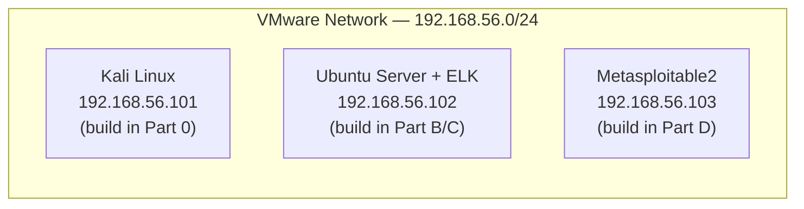

---

## Part 0 — Install VMware, Configure the Network, and Deploy Kali Linux

### 0.1 Install VMware Workstation

1. Go to https://www.vmware.com/products/workstation-pro.html (VMware Workstation Pro is now free for personal use) or https://www.vmware.com/products/workstation-player.html for the lighter free Player edition.
2. Download the Windows installer.
3. Run the installer, accept the license agreement, and use the default install location and options unless you have a specific reason to change them.
4. Restart your host machine if prompted.
5. Launch **VMware Workstation** once to confirm it opens correctly — you should land on its "Home" tab with no virtual machines listed yet.

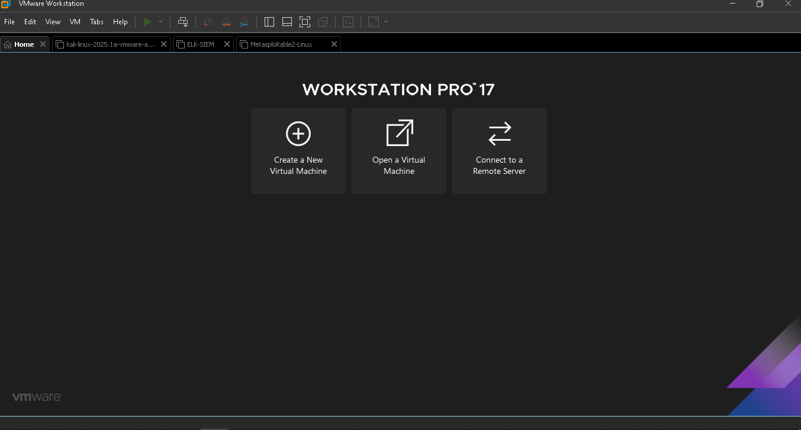

### 0.2 Configure the Shared Virtual Network

All three VMs in this course need to sit on the exact same isolated virtual network, with a specific subnet (`192.168.56.0/24`) — this must be set up **before** creating any VM, so every VM you build afterward can simply select it.

1. In VMware Workstation, go to **Edit → Virtual Network Editor**. (If the options are grayed out, click **Change Settings** at the bottom — this requires administrator rights.)
2. Look for an existing **Host-only** network (commonly named `VMnet1` or `VMnet2`). If none exists, click **Add Network...** and choose an unused VMnet number.
3. Select that network, set its type to **Host-only** (uncheck "Connect a host virtual adapter to this network" is fine either way — leaving it checked lets your physical host machine also reach this network directly, which can be convenient but isn't required).
4. Click **Subnet IP** / set the subnet manually to:
   ```
   192.168.56.0
   ```
   with subnet mask `255.255.255.0`.
5. Make sure **"Use local DHCP service to distribute IP addresses to VMs"** is **unchecked** — every VM in this course uses a manually assigned static IP, not DHCP, so a competing DHCP server on this network would only cause confusion later.
6. Click **Apply**, then **OK**.

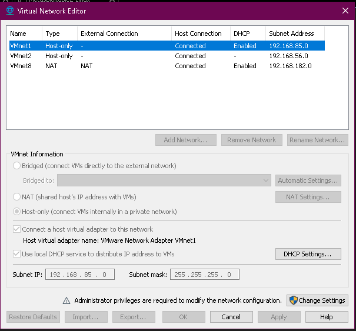

Note which VMnet number you configured (e.g. `VMnet2`) — you'll select this exact network for all three VMs in this course.

### 0.3 Download and Deploy the Kali Linux VM

Rather than installing Kali from an ISO (a much longer process), Kali's team publishes ready-to-run VMware images, which is what this course uses.

1. Go to https://www.kali.org/get-kali/#kali-virtual-machines
2. Under **VMware**, download the 64-bit VMware image (a `.7z` archive).
3. Extract the archive using [7-Zip](https://www.7-zip.org/) (Windows doesn't open `.7z` natively) — right-click the downloaded file → **7-Zip → Extract Here**, once 7-Zip is installed.
4. In VMware Workstation: **File → Open**, browse into the extracted folder, and select the `.vmx` file.
5. If prompted **"This virtual machine may have been moved or copied"**, choose **"I copied it"** (this regenerates the VM's network identity so it doesn't collide with anything).
6. Before powering on, open **VM Settings → Network Adapter** and set it to **Custom: Specific virtual network** → select the exact VMnet you configured in Part 0.2.

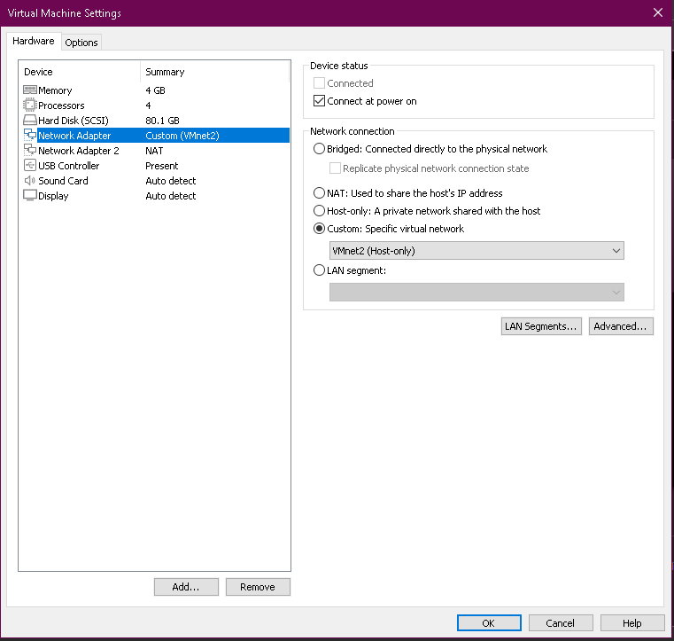

7. Power on the VM. Default credentials: username `kali`, password `kali`.

### 0.4 Set Kali's Static IP

Kali's prebuilt image defaults to DHCP. Set a static IP matching this course's addressing scheme.

Open a terminal in Kali and check the interface name:

```bash
ip a
```

Edit the Netplan config (adjust the interface name — likely `eth0` — to match what `ip a` actually showed):

```bash
sudo nano /etc/netplan/01-network-manager-all.yaml
```

Set it to:

```yaml
network:
  version: 2
  ethernets:
    eth0:
      dhcp4: no
      addresses: [192.168.56.101/24]
      nameservers:
        addresses: [8.8.8.8]
```

Apply it:

```bash
sudo netplan apply
ip a
```

Confirm it now shows `192.168.56.101`.

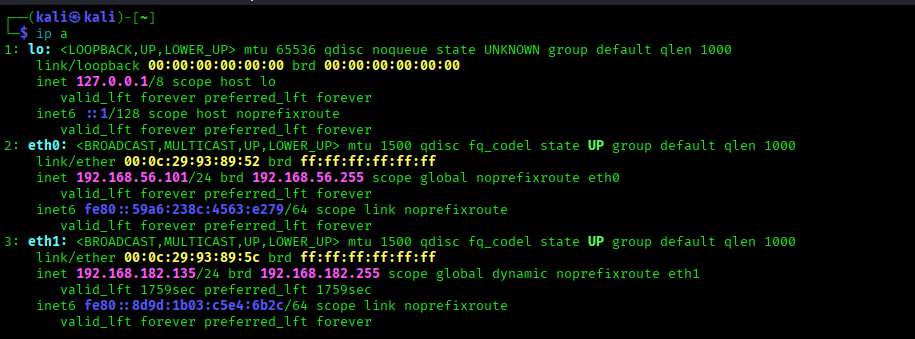

**Milestone!:** you now have a working Kali VM at `192.168.56.101` on your dedicated lab network. The rest of this document (Parts A onward) builds the remaining two VMs on the same network.

---

## Part A — Confirm the VMware Network

Your Kali VM already has IP `192.168.56.101/24`, which tells us which VMware virtual network it's on. We need the two new VMs on that **exact same** network.

1. Open **VMware** → right-click your **Kali VM** → **Settings** → **Network Adapter**.
2. Note which option is selected: usually either **Host-only**, or **Custom (VMnet_)** with a specific VMnet number. Write down the exact setting/name.

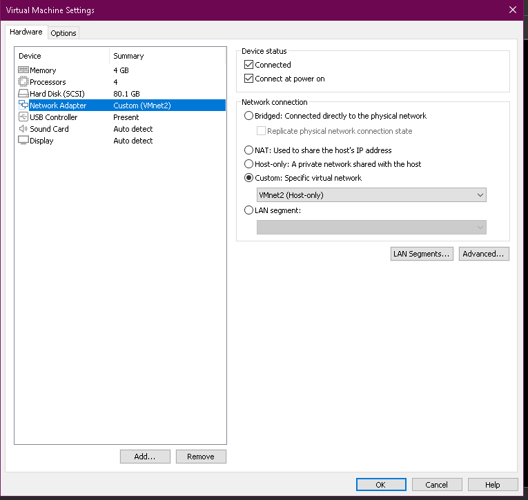

3. Keep this exact setting in mind — you will select the **identical** option when creating the next two VMs in Parts B and D.


---

## Part B — Create the Ubuntu Server VM (future ELK host)

### B.1 Download Ubuntu Server

1. On your **host machine** (not Kali), go to https://ubuntu.com/download/server
2. Download **Ubuntu Server 22.04.x LTS** (the `.iso` file). This is a long-term-support release, which matters for package stability with the Elastic Stack.

### B.2 Create the VM in VMware

1. VMware → **File → New Virtual Machine → Typical → Installer disc image (.iso)** → browse to the Ubuntu ISO you downloaded.
2. Guest OS: **Linux → Ubuntu 64-bit**.
3. VM name: `ELK-SIEM`. Choose a storage location.
4. **Disk size: 40 GB minimum** (Elasticsearch indices grow fast even in a lab).
5. Hardware customization before finishing:
   - **RAM: 4 GB minimum** (6–8 GB strongly preferred if your host has it — Elasticsearch alone wants ~2 GB heap).
   - **CPU: 2 cores minimum.**
   - **Network Adapter:** set to the **same option you recorded in Part A** (e.g. Host-only / the same VMnet).

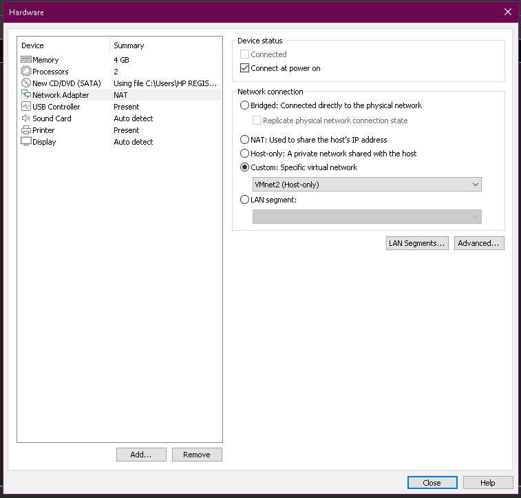

### B.3 Install Ubuntu Server

1. Boot the VM, run through the Ubuntu Server installer:
   - Language/keyboard: defaults are fine.
   - Network: leave on DHCP for now — we'll fix the IP after install so it's guaranteed static.
   - Storage: "Use entire disk," default LVM layout is fine.
   - Profile setup: create a user, e.g. username `socadmin`. **Remember this password.**
   - **Important:** on the "SSH Setup" screen, tick **Install OpenSSH server**. You'll want to SSH into this box from Kali instead of using the VMware console.
   - Skip featured server snaps.
2. Let it install, reboot when prompted (remove installation media if asked).
3. Log in at the console once to confirm it boots, then run:
   ```bash
   ip a
   ```
   Note the IP DHCP assigned (should be in the `192.168.56.x` range).

### B.4 Set a Static IP (192.168.56.102)

Ubuntu 22.04 uses Netplan. Edit the config:

```bash
sudo nano /etc/netplan/00-installer-config.yaml
```

Replace its contents with (adjust `eth0`/`ens33` to match your actual interface name from `ip a`):

```yaml
network:
  version: 2
  ethernets:
    ens33:
      dhcp4: no
      addresses: [192.168.56.102/24]
      nameservers:
        addresses: [8.8.8.8]
```

Apply it:

```bash
sudo netplan apply
ip a
```

Confirm it now shows `192.168.56.102`.

### B.5 Connect from Kali via SSH (recommended from here on)

From your Kali terminal:

```bash
ssh socadmin@192.168.56.102
```

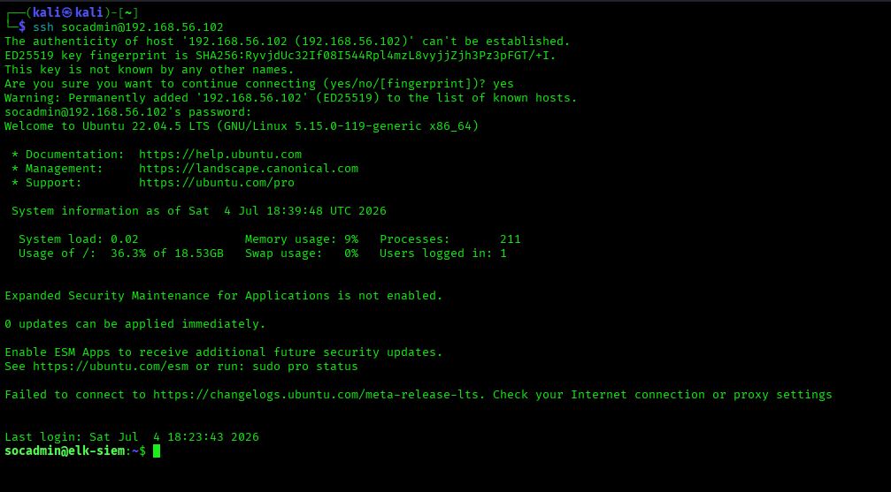

All commands in Part C are run **on this Ubuntu VM** (via this SSH session).

---

## Part C — Install the ELK Stack on the Ubuntu VM

We'll install **Elasticsearch** (storage/search engine) and **Kibana** (dashboards/UI). Logstash isn't needed yet — for these labs, log shipping is handled by **Filebeat** (lightweight shipper), installed per-lab when needed. For this lab course, we disable Elastic's built-in TLS/security layer (`xpack.security`) since this is an isolated offline lab, not production — this avoids certificate setup that would otherwise block beginners. This is called out explicitly so it's never mistaken for a production practice.

### C.0 Enable Temporary Internet Access (Second NAT Adapter)

Your ELK-SIEM VM's only network adapter is **Host-only (VMnet2)**, static IP `192.168.56.102` — correct for talking to Kali and Metasploitable2, but Host-only networks are deliberately isolated from the internet. `apt` needs internet access to download Elasticsearch/Kibana. Add a **second** adapter just for this:

1. Shut down the VM: `sudo shutdown now`
2. VMware → **ELK-SIEM → Settings → Add... → Network Adapter → Finish**
3. Select the new adapter → set connection type to **NAT**
4. Power the VM back on
5. **Important:** back in Part B.4 you replaced the entire Netplan config to add the static IP on `ens33`. That file has no entry for this new adapter, so Netplan leaves it down by default — it won't pick up an address on its own. Add it explicitly:
   ```bash
   sudo nano /etc/netplan/00-installer-config.yaml
   ```
   Make sure the file contains **both** interfaces:
   ```yaml
   network:
     version: 2
     ethernets:
       ens33:
         dhcp4: no
         addresses: [192.168.56.102/24]
         nameservers:
           addresses: [8.8.8.8]
       ens37:
         dhcp4: yes
   ```
   (Confirm your new adapter's actual name via `ip a` first — it may not be exactly `ens37`.)
6. Apply and verify:
   ```bash
   sudo netplan apply
   ip a
   ping -c 3 8.8.8.8
   ```

Your original static IP (`192.168.56.102` on `ens33`) is untouched — this NAT adapter is purely for package installation. Keep it attached; there's no harm leaving it on for the rest of the course, but it's not part of the "lab network" the other VMs communicate over.

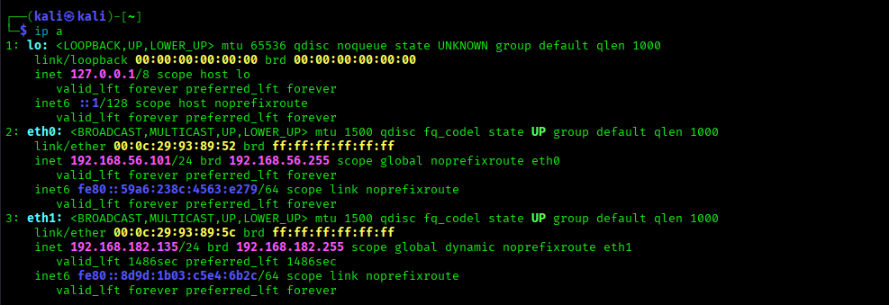

### C.1 Prerequisites

```bash
sudo apt update && sudo apt upgrade -y
sudo apt install -y apt-transport-https curl gnupg
```

### C.2 Add the Elastic Package Repository

```bash
curl -fsSL https://artifacts.elastic.co/GPG-KEY-elasticsearch | sudo gpg --dearmor -o /usr/share/keyrings/elastic.gpg
echo "deb [signed-by=/usr/share/keyrings/elastic.gpg] https://artifacts.elastic.co/packages/8.x/apt stable main" | sudo tee /etc/apt/sources.list.d/elastic-8.x.list
sudo apt update
```

### C.3 Install and Configure Elasticsearch

```bash
sudo apt install -y elasticsearch
```

Edit the config:

```bash
sudo nano /etc/elasticsearch/elasticsearch.yml
```

**Note on Elasticsearch 8.x:** the installer automatically appends a block near the bottom of this file titled `----- BEGIN SECURITY AUTO CONFIGURATION -----` containing TLS certificate paths and enrollment settings. This is normal — every 8.x install does this. For this lab, we replace that entire block, since managing certificates adds setup complexity with no benefit on an isolated training network.

**Delete everything** from `#----------------------- BEGIN SECURITY AUTO CONFIGURATION -----------------------` through `#----------------------- END SECURITY AUTO CONFIGURATION -------------------------` (both marker lines included).

The rest of the file is almost entirely comments (lines starting with `#`) — leave those as they are. You only need to make sure these **active** (non-`#`) lines exist somewhere in the file. The safest approach: select the entire file contents in nano (or just delete everything) and replace it with exactly this:

```yaml
path.data: /var/lib/elasticsearch
path.logs: /var/log/elasticsearch
network.host: 192.168.56.102
http.port: 9200
discovery.type: single-node

xpack.security.enabled: false
xpack.security.enrollment.enabled: false
xpack.security.http.ssl.enabled: false
xpack.security.transport.ssl.enabled: false
```

> ⚠️ **Attention!:** if you only delete the security auto-config block and leave the commented template above it, `path.data` and `path.logs` remain commented out (`#path.data: ...`) and Elasticsearch will fall back to writing inside `/usr/share/elasticsearch/data`, which isn't writable by the `elasticsearch` user — it will crash with `AccessDeniedException`. Replacing the whole file with the block above avoids this entirely.

Save and exit (`Ctrl+O`, `Enter`, `Ctrl+X`).

Start it:

```bash
sudo systemctl daemon-reload
sudo systemctl enable --now elasticsearch
```

Verify (wait around 30 seconds for first time):

```bash
curl http://192.168.56.102:9200
```

You should get back a JSON block with `"cluster_name"` and version info.

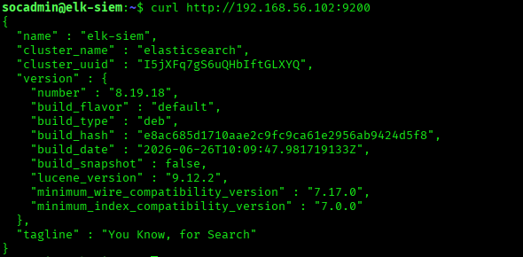

### C.4 Install and Configure Kibana

```bash
sudo apt install -y kibana
sudo nano /etc/kibana/kibana.yml
```

Set:

```yaml
server.host: "192.168.56.102"
server.port: 5601
elasticsearch.hosts: ["http://192.168.56.102:9200"]
```

Start it:

```bash
sudo systemctl enable --now kibana
```

### C.5 Open the Firewall (if `ufw` is active)

```bash
sudo ufw allow 9200/tcp
sudo ufw allow 5601/tcp
sudo ufw allow 5044/tcp   # for Filebeat, used in later labs
sudo ufw status
```

### C.6 Verify Kibana From a Browser

From your **Kali VM**, open Firefox and go to:

```
http://192.168.56.102:5601
```

You should land on the Kibana home screen (no login needed, since security is disabled for this lab).

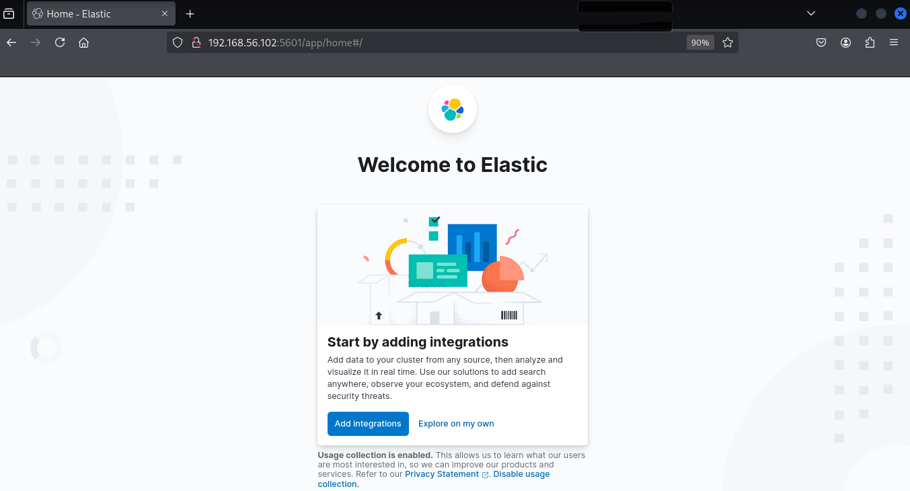

**Another milestone!:** if this loads, your SIEM is live. Every lab from here forward will ship logs into this Elasticsearch/Kibana instance.

---

## Part D — Deploy Metasploitable2 (Victim VM)

### D.1 Download

1. On your host machine: https://sourceforge.net/projects/metasploitable/ → download `Metasploitable2.zip`.
2. Extract it. Inside you'll find a `Metasploitable.vmx` file among others.

### D.2 Import into VMware

1. VMware → **File → Open** → browse to the extracted folder → select `Metasploitable.vmx`.
2. If prompted "This virtual machine may have been moved or copied," choose **"I copied it."** (This regenerates the network MAC/UUID so it doesn't collide with anything.)
3. Before booting, open **VM Settings → Network Adapter** and set it to the **same network as Kali and the ELK VM** (from Part A).

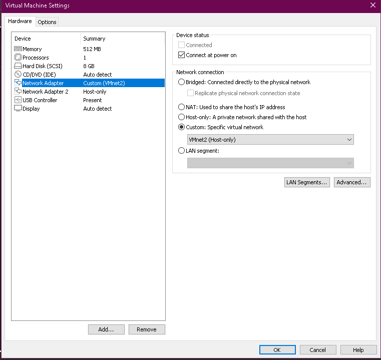

### D.3 Boot and Log In

1. Power on the VM. It boots to a text login prompt (no GUI — this is intentional, it's a deliberately old/vulnerable Ubuntu 8.04 base).
2. Default credentials:
   ```
   Login: msfadmin
   Password: msfadmin
   ```

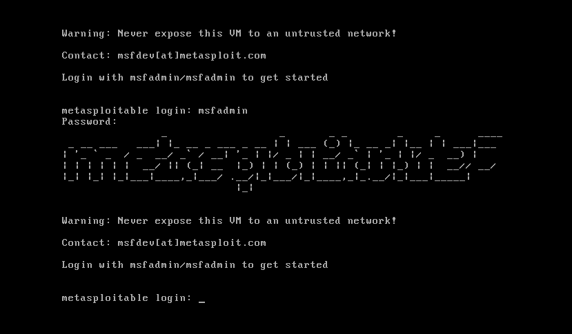

### D.4 Set a Static IP (192.168.56.103)

Metasploitable2's Ubuntu 8.04 predates Netplan — it uses the classic `ifupdown` system.

```bash
sudo nano /etc/network/interfaces
```

Replace the `eth0` block with:

```
auto eth0
iface eth0 inet static
    address 192.168.56.103
    netmask 255.255.255.0
```

Apply it:

```bash
sudo /etc/init.d/networking restart
ifconfig eth0
```

Confirm it now shows `192.168.56.103`.

> **Attention!:** As mentioned in the main repo readme file, Metasploitable2 is deliberately full of unpatched vulnerabilities. It must **never** be exposed to a bridged/NAT network with real internet access — only ever on this closed host-only lab network. Double-check its network adapter setting if you're ever unsure. Unlike the ELK-SIEM VM, **do not** add a NAT adapter to this machine and **do not** run `apt update`/`apt upgrade` on it — patching it would remove the very vulnerabilities these labs depend on.

### D.5 Known Issue: SSH Connections from Kali Will Fail by Default

Metasploitable2's SSH server only offers a legacy host-key type (`ssh-rsa`). Modern OpenSSH clients (including Kali 2025.3's) reject this by default for security reasons, so a plain `ssh msfadmin@192.168.56.103` will fail with `Unable to negotiate... no matching host key type found`. This isn't a network issue — it's a client compatibility policy, and it will affect every future lab that needs interactive SSH into this VM.

**Note:** Metasploitable2's SSH banner also lists `ssh-dss`, but don't add that to any config — modern OpenSSH (9.8+) has removed DSA support entirely, and including `ssh-dss` in an option string causes a hard parse error (`Bad key types`). Allowing `ssh-rsa` alone is sufficient.

**Fix it once, permanently, from Kali:**

```bash
nano ~/.ssh/config
```

Add:

```
Host metasploitable
    HostName 192.168.56.103
    User msfadmin
    HostKeyAlgorithms +ssh-rsa
    PubkeyAcceptedAlgorithms +ssh-rsa
```

Save and exit. From now on, connect with:

```bash
ssh metasploitable
```

instead of typing the full `ssh msfadmin@192.168.56.103` — the config applies the compatibility flag automatically.

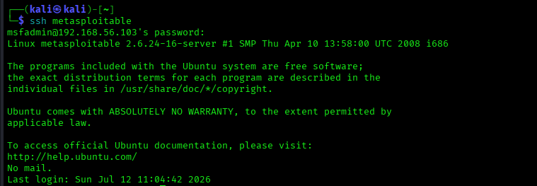

---

## Part E — Verify All Three Machines Can See Each Other

From **Kali**:

```bash
ping -c 3 192.168.56.102   # ELK VM
ping -c 3 192.168.56.103   # Metasploitable2
```

From the **ELK VM**:

```bash
ping -c 3 192.168.56.101   # Kali
ping -c 3 192.168.56.103   # Metasploitable2
```

All should succeed with 0% packet loss.

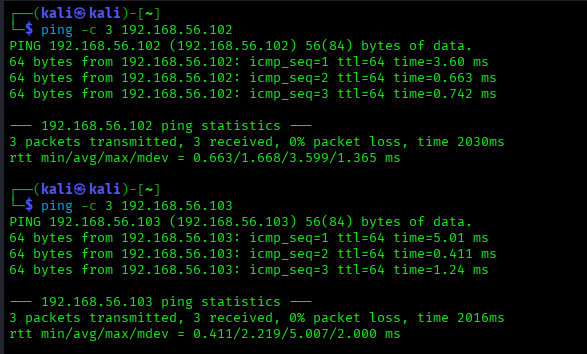

---

## Environment Reference Card

Keep this handy — every lab from now on refers back to these three addresses:

| Machine | IP | Credentials | Purpose |
|---|---|---|---|
| Kali Linux | `192.168.56.101` | (yours) | Attacker box, runs all offensive tools |
| ELK-SIEM (Ubuntu) | `192.168.56.102` | `socadmin` / (yours) | Kibana: `http://192.168.56.102:5601` |
| Metasploitable2 | `192.168.56.103` | `msfadmin` / `msfadmin` | Victim — intentionally vulnerable |


---

**Congratulations! You are now a Jedi!:** You are all set and fit to start the labs. May the force be with you.

---


## Troubleshooting

- **Kibana won't load in browser:** confirm Elasticsearch is up first (`curl http://192.168.56.102:9200`) — Kibana depends on it and will refuse to serve until Elasticsearch answers. Check `sudo systemctl status elasticsearch kibana`.
- **Elasticsearch fails to start / exits immediately:** almost always low memory. Check `sudo journalctl -u elasticsearch -n 50` — if you see OOM-related errors, increase the VM's RAM or cap the JVM heap in `/etc/elasticsearch/jvm.options.d/heap.options` (e.g. `-Xms1g` / `-Xmx1g`).
- **`apt update` fails with "Temporary failure resolving..." :** your VM's only adapter is Host-only, which has no internet route by design. Add a second NAT adapter (see Part C.0) — keep the original Host-only static IP untouched.
- **Can't ping between VMs:** almost always a network adapter mismatch — re-check Part A/B.2/D.2, all three VMs must use the exact same VMware network setting.
- **Metasploitable2 network changes don't stick after reboot:** confirm you edited `/etc/network/interfaces` (not a Netplan file — this OS predates Netplan) and ran the `/etc/init.d/networking restart` command, not `netplan apply`.

---
