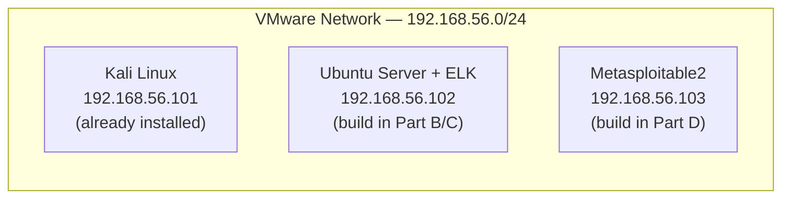

# Phase 0 — Environment Setup
### Building the 3-VM SOC Lab: Kali + ELK SIEM + Metasploitable2

## Goal

By the end of this phase you will have three VMware virtual machines, all on the same isolated internal network, able to reach each other:



You already have Kali at `192.168.56.101`. This phase adds the other two machines. Nothing here is lab-specific — you build this once, and reuse it for all 9 labs.

**Assumed starting point:** VMware (Workstation or Player) installed on your host, Kali Linux VM installed and working. Nothing else installed. Every tool below is installed from scratch.

---

## Part A — Confirm the VMware Network

Your Kali VM already has IP `192.168.56.101/24`, which tells us which VMware virtual network it's on. We need the two new VMs on that **exact same** network.

1. Open **VMware** → right-click your **Kali VM** → **Settings** → **Network Adapter**.
2. Note which option is selected: usually either **Host-only**, or **Custom (VMnet_)** with a specific VMnet number. Write down the exact setting/name.

> 📸 **CAPTURE THIS:** Screenshot of Kali's Network Adapter settings screen showing which network it's on.
> Save as `00-01-kali-network-adapter-settings.png` → embed here:
> ``

3. Keep this exact setting in mind — you will select the **identical** option when creating the next two VMs in Parts B and D.

---

## Part B — Create the Ubuntu Server VM (future ELK host)

### B.1 Download Ubuntu Server

1. On your **host machine** (not Kali), go to https://ubuntu.com/download/server
2. Download **Ubuntu Server 22.04.x LTS** (the `.iso` file). This is a long-term-support release, which matters for package stability with the Elastic Stack.

### B.2 Create the VM in VMware

1. VMware → **File → New Virtual Machine → Typical → Installer disc image (.iso)** → browse to the Ubuntu ISO you downloaded.
2. Guest OS: **Linux → Ubuntu 64-bit**.
3. VM name: `ELK-SIEM`. Choose a storage location.
4. **Disk size: 40 GB minimum** (Elasticsearch indices grow fast even in a lab).
5. Hardware customization before finishing:
   - **RAM: 4 GB minimum** (6–8 GB strongly preferred if your host has it — Elasticsearch alone wants ~2 GB heap).
   - **CPU: 2 cores minimum.**
   - **Network Adapter:** set to the **same option you recorded in Part A** (e.g. Host-only / the same VMnet).

> 📸 **CAPTURE THIS:** Screenshot of the VM hardware customization screen (RAM/CPU/Network settings) before install.
> Save as `00-02-ubuntu-vm-hardware-settings.png` → ``

### B.3 Install Ubuntu Server

1. Boot the VM, run through the Ubuntu Server installer:
   - Language/keyboard: defaults are fine.
   - Network: leave on DHCP for now — we'll fix the IP after install so it's guaranteed static.
   - Storage: "Use entire disk," default LVM layout is fine.
   - Profile setup: create a user, e.g. username `socadmin`. **Remember this password.**
   - **Important:** on the "SSH Setup" screen, tick **Install OpenSSH server**. You'll want to SSH into this box from Kali instead of using the VMware console.
   - Skip featured server snaps.
2. Let it install, reboot when prompted (remove installation media if asked).
3. Log in at the console once to confirm it boots, then run:
   ```bash
   ip a
   ```
   Note the IP DHCP assigned (should be in the `192.168.56.x` range).

### B.4 Set a Static IP (192.168.56.102)

Ubuntu 22.04 uses Netplan. Edit the config:

```bash
sudo nano /etc/netplan/00-installer-config.yaml
```

Replace its contents with (adjust `eth0`/`ens33` to match your actual interface name from `ip a`):

```yaml
network:
  version: 2
  ethernets:
    ens33:
      dhcp4: no
      addresses: [192.168.56.102/24]
      nameservers:
        addresses: [8.8.8.8]
```

Apply it:

```bash
sudo netplan apply
ip a
```

Confirm it now shows `192.168.56.102`.

### B.5 Connect from Kali via SSH (recommended from here on)

From your Kali terminal:

```bash
ssh socadmin@192.168.56.102
```

> 📸 **CAPTURE THIS:** Terminal screenshot from Kali showing a successful SSH login to the Ubuntu VM.
> Save as `00-03-ssh-into-ubuntu-elk.png` → ``

All commands in Part C are run **on this Ubuntu VM** (via this SSH session).

---

## Part C — Install the ELK Stack on the Ubuntu VM

We'll install **Elasticsearch** (storage/search engine) and **Kibana** (dashboards/UI). Logstash isn't needed yet — for these labs, log shipping is handled by **Filebeat** (lightweight shipper), installed per-lab when needed. For this lab course, we disable Elastic's built-in TLS/security layer (`xpack.security`) since this is an isolated offline lab, not production — this avoids certificate setup that would otherwise block beginners. This is called out explicitly so it's never mistaken for a production practice.

### C.0 Enable Temporary Internet Access (Second NAT Adapter)

Your ELK-SIEM VM's only network adapter is **Host-only (VMnet2)**, static IP `192.168.56.102` — correct for talking to Kali and Metasploitable2, but Host-only networks are deliberately isolated from the internet. `apt` needs internet access to download Elasticsearch/Kibana. Add a **second** adapter just for this:

1. Shut down the VM: `sudo shutdown now`
2. VMware → **ELK-SIEM → Settings → Add... → Network Adapter → Finish**
3. Select the new adapter → set connection type to **NAT**
4. Power the VM back on
5. Verify you now have a second interface with an internet-routable IP (via DHCP) alongside your original static `ens33`:
   ```bash
   ip a
   ping -c 3 8.8.8.8
   ```

Your original static IP (`192.168.56.102` on `ens33`) is untouched — this NAT adapter is purely for package installation. Keep it attached; there's no harm leaving it on for the rest of the course, but it's not part of the "lab network" the other VMs communicate over.

> 📸 **CAPTURE THIS:** Screenshot of `ip a` showing both interfaces (static Host-only + DHCP NAT).
> Save as `00-03b-elk-dual-network-adapters.png` → ``

### C.1 Prerequisites

```bash
sudo apt update && sudo apt upgrade -y
sudo apt install -y apt-transport-https curl gnupg
```

### C.2 Add the Elastic Package Repository

```bash
curl -fsSL https://artifacts.elastic.co/GPG-KEY-elasticsearch | sudo gpg --dearmor -o /usr/share/keyrings/elastic.gpg
echo "deb [signed-by=/usr/share/keyrings/elastic.gpg] https://artifacts.elastic.co/packages/8.x/apt stable main" | sudo tee /etc/apt/sources.list.d/elastic-8.x.list
sudo apt update
```

### C.3 Install and Configure Elasticsearch

```bash
sudo apt install -y elasticsearch
```

Edit the config:

```bash
sudo nano /etc/elasticsearch/elasticsearch.yml
```

Find/set these lines (add if missing):

```yaml
network.host: 192.168.56.102
discovery.type: single-node
xpack.security.enabled: false
```

Start it:

```bash
sudo systemctl daemon-reload
sudo systemctl enable --now elasticsearch
```

Verify (wait ~30 seconds for first boot):

```bash
curl http://192.168.56.102:9200
```

You should get back a JSON block with `"cluster_name"` and version info.

> 📸 **CAPTURE THIS:** Terminal screenshot of the `curl` output above showing Elasticsearch responding.
> Save as `00-04-elasticsearch-curl-verify.png` → ``

### C.4 Install and Configure Kibana

```bash
sudo apt install -y kibana
sudo nano /etc/kibana/kibana.yml
```

Set:

```yaml
server.host: "192.168.56.102"
server.port: 5601
elasticsearch.hosts: ["http://192.168.56.102:9200"]
```

Start it:

```bash
sudo systemctl enable --now kibana
```

### C.5 Open the Firewall (if `ufw` is active)

```bash
sudo ufw allow 9200/tcp
sudo ufw allow 5601/tcp
sudo ufw allow 5044/tcp   # for Filebeat, used in later labs
sudo ufw status
```

### C.6 Verify Kibana From a Browser

From your **Kali VM**, open Firefox and go to:

```
http://192.168.56.102:5601
```

You should land on the Kibana home screen (no login needed, since security is disabled for this lab).

> 📸 **CAPTURE THIS:** Screenshot of the Kibana home page loaded in the browser.
> Save as `00-05-kibana-home-page.png` → ``

**Checkpoint:** if this loads, your SIEM is live. Every lab from here forward will ship logs into this Elasticsearch/Kibana instance.

---

## Part D — Deploy Metasploitable2 (Victim VM)

### D.1 Download

1. On your host machine: https://sourceforge.net/projects/metasploitable/ → download `Metasploitable2.zip`.
2. Extract it. Inside you'll find a `Metasploitable.vmx` file among others.

### D.2 Import into VMware

1. VMware → **File → Open** → browse to the extracted folder → select `Metasploitable.vmx`.
2. If prompted "This virtual machine may have been moved or copied," choose **"I copied it."** (This regenerates the network MAC/UUID so it doesn't collide with anything.)
3. Before booting, open **VM Settings → Network Adapter** and set it to the **same network as Kali and the ELK VM** (from Part A).

> 📸 **CAPTURE THIS:** Screenshot of Metasploitable2's Network Adapter settings, matching the shared lab network.
> Save as `00-06-metasploitable-network-adapter.png` → ``

### D.3 Boot and Log In

1. Power on the VM. It boots to a text login prompt (no GUI — this is intentional, it's a deliberately old/vulnerable Ubuntu 8.04 base).
2. Default credentials:
   ```
   Login: msfadmin
   Password: msfadmin
   ```

> 📸 **CAPTURE THIS:** Screenshot of the Metasploitable2 login banner/prompt.
> Save as `00-07-metasploitable-login-banner.png` → ``

### D.4 Set a Static IP (192.168.56.103)

Metasploitable2's Ubuntu 8.04 predates Netplan — it uses the classic `ifupdown` system.

```bash
sudo nano /etc/network/interfaces
```

Replace the `eth0` block with:

```
auto eth0
iface eth0 inet static
    address 192.168.56.103
    netmask 255.255.255.0
```

Apply it:

```bash
sudo /etc/init.d/networking restart
ifconfig eth0
```

Confirm it now shows `192.168.56.103`.

> **Security note:** Metasploitable2 is deliberately full of unpatched vulnerabilities. It must **never** be exposed to a bridged/NAT network with real internet access — only ever on this closed host-only lab network. Double-check its network adapter setting if you're ever unsure. Unlike the ELK-SIEM VM, **do not** add a NAT adapter to this machine and **do not** run `apt update`/`apt upgrade` on it — patching it would remove the very vulnerabilities these labs depend on.

---

## Part E — Verify All Three Machines Can See Each Other

From **Kali**:

```bash
ping -c 3 192.168.56.102   # ELK VM
ping -c 3 192.168.56.103   # Metasploitable2
```

From the **ELK VM**:

```bash
ping -c 3 192.168.56.101   # Kali
ping -c 3 192.168.56.103   # Metasploitable2
```

All should succeed with 0% packet loss.

> 📸 **CAPTURE THIS:** One terminal screenshot from Kali showing both successful pings (102 and 103).
> Save as `00-08-connectivity-verification.png` → ``

---

## Environment Reference Card

Keep this handy — every lab from now on refers back to these three addresses:

| Machine | IP | Credentials | Purpose |
|---|---|---|---|
| Kali Linux | `192.168.56.101` | (yours) | Attacker box, runs all offensive tools |
| ELK-SIEM (Ubuntu) | `192.168.56.102` | `socadmin` / (yours) | Kibana: `http://192.168.56.102:5601` |
| Metasploitable2 | `192.168.56.103` | `msfadmin` / `msfadmin` | Victim — intentionally vulnerable |

---

## Troubleshooting

- **Kibana won't load in browser:** confirm Elasticsearch is up first (`curl http://192.168.56.102:9200`) — Kibana depends on it and will refuse to serve until Elasticsearch answers. Check `sudo systemctl status elasticsearch kibana`.
- **Elasticsearch fails to start / exits immediately:** almost always low memory. Check `sudo journalctl -u elasticsearch -n 50` — if you see OOM-related errors, increase the VM's RAM or cap the JVM heap in `/etc/elasticsearch/jvm.options.d/heap.options` (e.g. `-Xms1g` / `-Xmx1g`).
- **`apt update` fails with "Temporary failure resolving..." :** your VM's only adapter is Host-only, which has no internet route by design. Add a second NAT adapter (see Part C.0) — keep the original Host-only static IP untouched.
- **Can't ping between VMs:** almost always a network adapter mismatch — re-check Part A/B.2/D.2, all three VMs must use the exact same VMware network setting.
- **Metasploitable2 network changes don't stick after reboot:** confirm you edited `/etc/network/interfaces` (not a Netplan file — this OS predates Netplan) and ran the `/etc/init.d/networking restart` command, not `netplan apply`.

---

## Completion Checklist

- [ ] Kali confirmed on network `192.168.56.101`
- [ ] Ubuntu Server VM created, static IP `192.168.56.102`
- [ ] SSH access from Kali → ELK VM working
- [ ] Elasticsearch installed, responds on port 9200
- [ ] Kibana installed, loads in browser on port 5601
- [ ] Metasploitable2 imported, static IP `192.168.56.103`
- [ ] All 3 machines ping each other successfully
- [ ] All 8 screenshots captured and named per the convention above

Once every box above is checked, you're ready for **Lab 1 — SSH Brute-Force Detection in ELK**.
