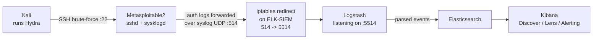

# Lab 1 — SSH Brute-Force Detection in ELK

## Lab Overview

**Purpose:** Simulate a real SSH credential-stuffing attack against a Linux target, get the resulting authentication logs into your SIEM, and build a detection that fires based on failed-login velocity — the same pattern real SOC teams use to catch brute-force and password-spray attacks.

**What you'll learn:**
- How SSH authentication failures actually look in raw Linux logs
- How to get logs from a machine too old for modern log-shipping agents into a modern SIEM (a real-world problem, not just a lab contrivance)
- How to build a Kibana visualization and a threshold-based alert
- How to write up a detection finding the way a SOC analyst documents one

**Attack technique:** Dictionary-based SSH brute-force using Hydra.

**Tools used:**

| Tool | Role | Runs on |
|---|---|---|
| Hydra | Brute-force attack tool | Kali |
| rsyslog/sysklogd | Forwards auth logs off the old victim box | Metasploitable2 (already installed) |
| Logstash | Receives forwarded syslog, parses it, sends to Elasticsearch | ELK-SIEM |
| Kibana | Visualization + alerting | ELK-SIEM |

## Architecture for This Lab



---

## Part 1 — Verify Hydra Is Available on Kali

Kali usually ships with Hydra preinstalled, but per this course's rule, we verify rather than assume.

```bash
which hydra
hydra -h | head -20
```

If you get "command not found," install it (requires your NAT adapter from Phase 0 for internet access):

```bash
sudo apt update
sudo apt install -y hydra
```

> 📸 **CAPTURE THIS:** Terminal output of `hydra -h` showing the help/version banner.
> Save as `lab01-01-hydra-version-check.png` → ``

---

## Part 2 — Confirm the SSH Target Is Reachable

From Kali, test a manual login to make sure the target is alive before automating anything. This uses the `metasploitable` SSH alias set up in Phase 0 (Part D.5) to work around Metasploitable2's legacy SSH algorithms:

```bash
ssh metasploitable
```

(If you skipped that step, see [Phase 0 Part D.5](../00-Environment-Setup/README.md) — a plain `ssh msfadmin@192.168.56.103` will fail with a host-key negotiation error on modern Kali.)

Type `yes` to accept the host key, enter password `msfadmin`, confirm you land at a shell prompt, then `exit`.

> 📸 **CAPTURE THIS:** Terminal showing the successful manual SSH login and the Metasploitable2 shell prompt.
> Save as `lab01-02-manual-ssh-login.png` → ``

---

## Part 3 — Install and Configure Logstash on ELK-SIEM

SSH into ELK-SIEM (`ssh socadmin@192.168.56.102`) for this whole part.

### 3.1 Install Logstash

The Elastic repository is already configured from Phase 0, so:

```bash
sudo apt update
sudo apt install -y logstash
```

### 3.2 Create a Syslog Input Pipeline

We use port `5514` rather than the standard syslog port `514`. This is a deliberate design choice, not just a convenience: `514` is a *privileged* port (anything below 1024), and only root can normally bind to it. Logstash runs as an unprivileged `logstash` user, and — importantly — **do not use `setcap` to try to grant this permission to Logstash's bundled Java binary.** Linux's dynamic linker strips relative library search paths from any binary that has file capabilities set, which breaks Java's ability to find its own runtime libraries (`libjli.so`) and crashes it on every startup. Part 3.4 below covers the correct way to still receive traffic on `514`.

```bash
sudo nano /etc/logstash/conf.d/ssh-auth-pipeline.conf
```

Paste in:

```
input {
  syslog {
    port => 5514
  }
}

filter {
  if "Failed password" in [message] {
    mutate { add_field => { "event_outcome" => "failure" } }
  } else if "Accepted password" in [message] {
    mutate { add_field => { "event_outcome" => "success" } }
  }
}

output {
  elasticsearch {
    hosts => ["http://192.168.56.102:9200"]
    index => "ssh-auth-logs-%{+YYYY.MM.dd}"
  }
  stdout { codec => rubydebug }
}
```

Save and exit (`Ctrl+O`, `Enter`, `Ctrl+X`).

### 3.3 Start Logstash and Open the Port

```bash
sudo systemctl enable --now logstash
sudo ufw allow 5514/udp
sudo ufw allow 5514/tcp
```

Give it about 30–60 seconds to fully initialize (Logstash is slower to start than Elasticsearch), then confirm it's listening:

```bash
sudo ss -tulpn | grep 5514
```

You should see `5514` listed under both UDP and TCP.

> 📸 **CAPTURE THIS:** Terminal showing the `ss -tulpn` output with port 5514 listening.
> Save as `lab01-03-logstash-listening.png` → ``

### 3.4 Redirect Port 514 to 5514 (Kernel-Level, No Special Permissions Needed)

Metasploitable2's logging daemon (see Part 4) can only send to the standard port `514`, but Logstash is listening on `5514`. Rather than touching Logstash's permissions, we redirect incoming traffic on `514` to `5514` at the network level using `iptables` — this needs no capability changes on any application at all.

```bash
sudo iptables -t nat -A PREROUTING -p udp --dport 514 -j REDIRECT --to-port 5514
sudo ufw allow 514/udp
```

Make this survive a reboot:

```bash
sudo apt install -y iptables-persistent
```

When prompted **"Save current IPv4 rules?"**, choose **Yes**. (You can say No to the IPv6 prompt — this lab only uses IPv4.)

> 📸 **CAPTURE THIS:** Terminal showing the `iptables` command and the `iptables-persistent` install/save prompt.
> Save as `lab01-03b-iptables-port-redirect.png` → ``

---

## Part 4 — Configure Metasploitable2 to Forward Auth Logs

SSH into Metasploitable2 (`ssh metasploitable`, using the alias from Phase 0 Part D.5) for this part.

**Important:** despite the filename similarity, do **not** edit `/etc/rsyslog.conf` on this machine. This particular Metasploitable2 build actually runs the older **`sysklogd`** daemon, which reads a completely different file (`/etc/syslog.conf`) and uses simpler forwarding syntax (UDP only, no custom ports). Confirm which daemon is actually running before editing anything:

```bash
ps aux | grep -i syslog
```

You should see `/sbin/syslogd` in the output — this confirms `sysklogd`, not `rsyslog`.

### 4.1 Edit the Logging Configuration

**Known issue:** if you connect via SSH from Kali (rather than the VMware console), `nano` may fail with `Error opening terminal: xterm-256color`. This happens because Metasploitable2's 2008-era terminfo database has no entry for the modern terminal type your SSH session passes through. Fix it for this session:

```bash
export TERM=xterm
```

(If that alone doesn't resolve it, try `export TERM=vt100` instead.)

Then:

```bash
sudo nano /etc/syslog.conf
```

Find this existing line near the top:

```
auth,authpriv.*                 /var/log/auth.log
```

Add a second line directly beneath it (keep the original — this way logs still write locally too, in addition to forwarding):

```
auth,authpriv.*                 /var/log/auth.log
auth,authpriv.*                 @192.168.56.102
```

A single `@` is correct here — classic `sysklogd` only supports UDP forwarding, and has no `@@` (TCP) syntax and no way to specify a custom port. It always sends to the destination's port `514`, which is why Part 3.4 set up a redirect from `514` to Logstash's actual listener on `5514`.

Save and exit.

### 4.2 Restart the Logging Daemon

```bash
sudo /etc/init.d/sysklogd restart
```

> 📸 **CAPTURE THIS:** Terminal showing the edited top of `/etc/syslog.conf` (use `head -10 /etc/syslog.conf` for a clean screenshot) and the successful restart command.
> Save as `lab01-04-syslog-forwarding-config.png` → ``

---

## Part 5 — Verify the Log Pipeline End-to-End

This step confirms the entire chain (Metasploitable2 → Logstash → Elasticsearch → Kibana) works **before** you run the actual attack — so if the brute-force step later produces nothing, you'll already know the pipeline itself isn't the problem.

### 5.1 Generate a Test Event

From Kali, deliberately fail one SSH login to the target (using the `metasploitable` alias from Phase 0 Part D.5):

```bash
ssh metasploitable
```

Enter an obviously wrong password (e.g. `wrongpass123`), let it reject you, then press `Ctrl+C`.

### 5.2 Check It Arrived in Elasticsearch

Back on ELK-SIEM:

```bash
curl "http://192.168.56.102:9200/ssh-auth-logs-*/_search?pretty&q=message:Failed"
```

You should see at least one JSON hit containing `"Failed password for msfadmin"` in the `message` field.

> 📸 **CAPTURE THIS:** Terminal showing this `curl` output with a matching hit.
> Save as `lab01-05-elasticsearch-first-event.png` → ``

### 5.3 Create the Kibana Data View

In your browser (from Kali): `http://192.168.56.102:5601`

1. Hamburger menu (☰, top-left) → **Stack Management → Data Views → Create data view**
2. Name: `SSH Auth Logs`
3. Index pattern: `ssh-auth-logs-*`
4. Timestamp field: `@timestamp`
5. **Save data view to Kibana**

### 5.4 View It in Discover

Hamburger menu → **Discover** → select the `SSH Auth Logs` data view (top-left dropdown) → confirm you see your test failed-login event.

> 📸 **CAPTURE THIS:** Screenshot of the Kibana Discover page showing at least one log entry.
> Save as `lab01-06-kibana-discover-first-event.png` → ``

**Checkpoint:** if you see the event in Discover, your full pipeline works. Proceed to the actual attack.

---

## Part 6 — Launch the Brute-Force Attack

Back on **Kali**.

### 6.1 Build a Password Wordlist

```bash
nano ~/passwords.txt
```

Add several wrong guesses and bury the real one in the middle, to make the attack realistic:

```
password
123456
admin123
letmein
msfadmin
qwerty123
football
```

Save and exit.

### 6.2 Fix Hydra's SSH Algorithm Compatibility

**Important:** Hydra does **not** use your system's OpenSSH client — it has its own bundled `libssh` implementation with a separate algorithm list, so the `metasploitable` alias from Phase 0 Part D.5 does not apply to it. Hydra connects by raw IP, so we need a matching `Host` entry for the IP itself, with a broader set of legacy algorithms than the plain SSH client needed (Metasploitable2's sshd is old enough to disagree with Hydra's client on key exchange, ciphers, and MAC algorithms all at once).

```bash
nano ~/.ssh/config
```

Add this **second**, separate block (keep your existing `metasploitable` block too):

```
Host 192.168.56.103
    HostKeyAlgorithms +ssh-rsa
    PubkeyAcceptedAlgorithms +ssh-rsa
    KexAlgorithms +diffie-hellman-group14-sha1,diffie-hellman-group1-sha1
    Ciphers +aes128-cbc,3des-cbc,aes192-cbc,aes256-cbc
    MACs +hmac-sha1,hmac-md5
```

Save and exit.

### 6.3 Run Hydra

```bash
hydra -l msfadmin -P ~/passwords.txt ssh://192.168.56.103 -t 4 -f
```

- `-l msfadmin` — target this single known username (real attacks often already have a username from OSINT/leaks)
- `-P` — path to your password list
- `-t 4` — 4 parallel connection threads
- `-f` — stop as soon as a valid combination is found

Let it run to completion. You should see a line like:

```
[22][ssh] host: 192.168.56.103   login: msfadmin   password: msfadmin
[STATUS] attack finished for 192.168.56.103 (valid pair found)
```

> 📸 **CAPTURE THIS:** Terminal showing the full Hydra run, ending in its `[STATUS]` success line reporting the found password.
> Save as `lab01-07-hydra-attack-success.png` → ``

---

## Part 7 — Build the Detection Visualization

Back in **Kibana**.

### 7.1 Confirm the Attack Landed in Logs

**Discover** → data view `SSH Auth Logs` → in the search bar type:

```
message: "Failed password"
```

You should see a burst of failed-login events clustered in the exact timeframe you ran Hydra.

> 📸 **CAPTURE THIS:** Discover view filtered to `message: "Failed password"`, showing the burst of events.
> Save as `lab01-08-discover-failed-login-burst.png` → ``

### 7.2 Build a Lens Visualization

1. Hamburger menu → **Visualize Library → Create visualization → Lens**
2. Data view: `SSH Auth Logs`
3. Chart type: **Bar vertical**
4. Horizontal axis: `@timestamp`, bucket interval: **Minute**
5. Vertical axis: **Count of records**
6. Add a filter at the top of the Lens editor: `message: "Failed password"`
7. Title it: **SSH Failed Logins Over Time**
8. **Save**

> 📸 **CAPTURE THIS:** The finished Lens bar chart showing a clear spike during the attack window.
> Save as `lab01-09-lens-failed-logins-chart.png` → ``

---

## Part 8 — Build a Threshold-Based Alert

This is the core "detection engineering" deliverable of the lab — turning a pattern you can see into a rule that fires automatically.

### 8.0 Configure Kibana's Alerting Encryption Key (One-Time Setup)

Before Kibana's Alerting feature can be used at all, it needs an encryption key configured — this is required regardless of whether authentication/security is enabled, since alert rules and connectors store encrypted saved objects. If you go straight to **Stack Management → Rules → Create rule** without this, you'll see "Additional setup required: You must configure an encryption key to use Alerting."

On ELK-SIEM:

```bash
cd /usr/share/kibana
sudo bin/kibana-encryption-keys generate
```

This prints three lines like:

```yaml
xpack.encryptedSavedObjects.encryptionKey: <random-string>
xpack.reporting.encryptionKey: <random-string>
xpack.security.encryptionKey: <random-string>
```

Add those exact three lines (with their real generated values) to the bottom of Kibana's config:

```bash
sudo nano /etc/kibana/kibana.yml
```

Save, then restart:

```bash
sudo systemctl restart kibana
```

Wait ~20–30 seconds, then reload the Rules page — the warning should be gone.

> 📸 **CAPTURE THIS:** Terminal showing the `kibana-encryption-keys generate` command running (crop/blur the actual key values if concerned about publishing them, though risk is low on an isolated lab network).
> Save as `lab01-10b-kibana-encryption-keys.png` → ``

If the connector picker later shows options grayed out as "Platinum license required," activate Elasticsearch's free 30-day trial license, which unlocks them (this is unrelated to the encryption key, but both are one-time setup steps for Alerting):

```bash
curl -X POST "http://192.168.56.102:9200/_license/start_trial?acknowledge=true&pretty"
sudo systemctl restart kibana
```

> 📸 **CAPTURE THIS:** Terminal showing the trial license activation response (`"trial_was_started": true`).
> Save as `lab01-10c-elasticsearch-trial-license.png` → ``

### 8.1 Create the Rule

1. Hamburger menu → **Stack Management → Rules → Create rule**
2. Rule type: **Elasticsearch query** (a built-in Kibana rule type — no extra plugin needed)
3. Index: `ssh-auth-logs-*`
4. Query (KQL): `message: "Failed password"`
5. Threshold: **Count is above `5`**
6. Time window: **1 minute**
7. Check every: **1 minute**
8. **Skip "Add action."** In some Kibana versions, the connector picker for generic Stack Rules only exposes a couple of unrelated connector types (e.g. Cases) regardless of license — a known quirk, not something you did wrong. An action isn't required to prove the detection works: a rule with zero actions still evaluates on schedule and shows as **Active** in the Alerts tab when its condition is met, which is exactly what we check in Part 8.2. (Real detection engineering often works the same way — build and tune the logic first, wire up notifications once it's trusted.)
9. Name the rule: **SSH Brute-Force Threshold Alert**
10. **Save**

> 📸 **CAPTURE THIS:** The rule configuration screen showing the threshold condition (step 5–7) before saving.
> Save as `lab01-10-alert-rule-config.png` → ``

### 8.2 Confirm It Fired

Re-run the Hydra attack from Part 6 once more (same command) to trigger the rule live, then:

Hamburger menu → **Stack Management → Rules** → click into **SSH Brute-Force Threshold Alert** → **Execution history / Alerts** tab.

> 📸 **CAPTURE THIS:** The rule's execution/alerts history showing it triggered ("Active" status) around the time you re-ran Hydra.
> Save as `lab01-11-alert-fired-history.png` → ``

---

## Part 9 — Document the Finding

This is the write-up a real analyst would produce. Add a new section at the bottom of this lab's README (below the Completion Checklist) titled **"Investigation Write-Up"**, using this template:

```markdown
## Investigation Write-Up

**Date/Time of Attack:** [fill in from your Hydra run timestamp]
**Source:** 192.168.56.101 (Kali — simulated attacker)
**Target:** 192.168.56.103 (Metasploitable2)
**Technique:** SSH dictionary brute-force (Hydra, 7-entry wordlist, 4 threads)

### Timeline
| Time | Event |
|---|---|
| [ts] | First failed login attempt observed |
| [ts] | Failed-login count crosses threshold (5/min) |
| [ts] | Alert rule fires |
| [ts] | Successful login recorded (`msfadmin` password matched) |

### Detection Logic
Elasticsearch query rule on index `ssh-auth-logs-*`, counting documents matching
`message: "Failed password"`, threshold >5 events per 1-minute window.

### False Positive Considerations
A legitimate user mistyping their password 2–3 times would not cross this threshold.
Environments with many simultaneous legitimate users may need a per-source-IP
threshold instead of a global one — worth calling out as a tuning consideration
rather than something this lab solves outright.

### Evidence
(embed your screenshots from this lab here, e.g. ``)

### Recommendation
Rate-limit or temporarily lock accounts after repeated failures (e.g. `fail2ban`),
and consider disabling direct password auth on SSH in favor of key-based auth.
```

---

## Media Checklist for This Lab

| Filename | What it shows |
|---|---|
| `lab01-01-hydra-version-check.png` | Hydra installed/verified |
| `lab01-02-manual-ssh-login.png` | Manual SSH login to confirm target reachable |
| `lab01-03-logstash-listening.png` | Logstash listening on port 5514 |
| `lab01-03b-iptables-port-redirect.png` | iptables redirect from 514 to 5514 configured |
| `lab01-04-syslog-forwarding-config.png` | syslog forwarding rule on Metasploitable2 (sysklogd) |
| `lab01-05-elasticsearch-first-event.png` | First test event confirmed in Elasticsearch |
| `lab01-06-kibana-discover-first-event.png` | First event visible in Kibana Discover |
| `lab01-07-hydra-attack-success.png` | Hydra brute-force attack completing successfully |
| `lab01-08-discover-failed-login-burst.png` | Attack visible as a burst in Discover |
| `lab01-09-lens-failed-logins-chart.png` | Finished Lens visualization |
| `lab01-10b-kibana-encryption-keys.png` | Kibana alerting encryption keys configured |
| `lab01-10-alert-rule-config.png` | Alert rule threshold configuration |
| `lab01-11-alert-fired-history.png` | Alert firing in execution history |

## Troubleshooting

- **No events reaching Elasticsearch at all:** check Logstash is actually running (`sudo systemctl status logstash`) and listening on 5514 (`sudo ss -tulpn | grep 5514`). Then confirm the iptables redirect is in place (`sudo iptables -t nat -L PREROUTING -n`) and that Metasploitable2 can reach ELK-SIEM on port 514: from Metasploitable2, `telnet 192.168.56.102 514` should attempt a connection (Ctrl+], `quit` to exit — a refused/timeout response here means check the redirect and firewall rule again).
- **Never use `setcap` on Logstash's bundled `java` binary to allow binding port 514 directly.** It will cause Java to fail with `error while loading shared libraries: libjli.so: cannot open shared object file`, because Linux's dynamic linker strips relative library paths from any binary that has file capabilities set. Use the iptables redirect from Part 3.4 instead.
- **`sudo /etc/init.d/rsyslog restart` reports "command not found":** this Metasploitable2 build uses `sysklogd`, not `rsyslog`, despite `/etc/rsyslog.conf` existing as an unused leftover file. Confirm the real daemon with `ps aux | grep -i syslog` (look for `/sbin/syslogd`), and edit `/etc/syslog.conf` instead — see Part 4.
- **`nano` fails with `Error opening terminal: xterm-256color` on Metasploitable2 over SSH:** run `export TERM=xterm` (or `export TERM=vt100`) first — its 2008-era terminfo database doesn't recognize modern terminal types.
- **Connector picker for a Stack Rule only shows Cases / Observability AI Assistant, even on a trial license:** this is a Kibana quirk where built-in connectors (Server log, Index, etc.) aren't tagged for the generic "Stack Rules" feature area in some versions. Skip adding an action entirely — see Part 8.1 step 8 — the rule still evaluates and shows "Active" status without one.
- **SSH from Kali fails with "no matching host key type found":** see Phase 0 Part D.5 — add the `metasploitable` alias to `~/.ssh/config` with `HostKeyAlgorithms +ssh-rsa` and `PubkeyAcceptedAlgorithms +ssh-rsa`.
- **Hydra fails with a `kex error` (host key, MAC, or cipher mismatch), even after fixing plain SSH access:** Hydra uses its own bundled `libssh`, not your OpenSSH client — the `metasploitable` alias doesn't apply to it. Add the separate `Host 192.168.56.103` block from Part 6.2 to `~/.ssh/config`, matching Hydra's connection by raw IP.
- **Hydra reports all attempts failed, including the real password:** double-check you typed `msfadmin` correctly in your wordlist, and that you haven't locked yourself into a stale SSH host-key mismatch (rare on a lab network, but `ssh-keygen -R 192.168.56.103` clears it if needed).
- **Alert never fires even though Discover shows the burst:** confirm the rule's query field name matches exactly (`message`, not `Message`) and that the time window (1 minute) actually contains ≥5 events — Hydra with `-t 4 -f` can sometimes finish in under a minute across only 2–3 attempts if the real password is near the top of your list; add more decoy entries above `msfadmin` in your wordlist if this happens.

## Completion Checklist

- [ ] Hydra verified on Kali
- [ ] Manual SSH login to Metasploitable2 confirmed
- [ ] Logstash installed and listening on 5514
- [ ] rsyslog on Metasploitable2 forwarding auth logs
- [ ] Test event confirmed in Elasticsearch and Kibana Discover
- [ ] Hydra brute-force attack executed successfully
- [ ] Lens visualization built showing the attack
- [ ] Threshold alert rule created and confirmed firing
- [ ] All 11 screenshots captured and named per convention
- [ ] Investigation write-up section added

Once every box is checked, you're ready for **Lab 2 — Port Scan Detection Engineering Lab**.
