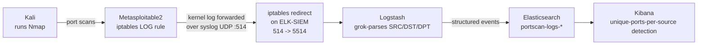

# Lab 2 — Port Scan Detection Engineering Lab

## Lab Overview

**Purpose:** Perform multiple Nmap reconnaissance scan types against a target, build SIEM detection logic to catch that reconnaissance, and deliberately tune it to avoid false-alarming on normal traffic. Unlike Lab 1, there's no existing log source for this — port scans don't write to any application log by default — so this lab starts by building the visibility itself.

**What you'll learn:**
- Why port scans are invisible to a SIEM by default, and how to create the missing telemetry
- How to parse structured fields out of raw kernel firewall logs using Logstash `grok`
- How to build a "unique ports touched per source per minute" detection — the actual technique real recon-detection rules use, not just "count of packets"
- How to deliberately test your detection against benign traffic to catch false positives *before* they'd wake someone up at 3am

**Attack technique:** Multiple Nmap scan types (SYN, Connect, ACK, UDP, host-discovery-skip, and stealth timing).

**Tools used:**

| Tool | Role | Runs on |
|---|---|---|
| Nmap | Reconnaissance scans | Kali |
| iptables | Logs incoming connection attempts (the log source this lab depends on) | Metasploitable2 |
| sysklogd | Forwards kernel log entries off the old victim box | Metasploitable2 (already installed, used in Lab 1) |
| Logstash | Parses scan log lines into structured fields, sends to Elasticsearch | ELK-SIEM |
| Kibana | Visualization + alerting | ELK-SIEM |

## Architecture for This Lab



This reuses the exact log-shipping path built in Lab 1 (`sysklogd` → port 514 → `iptables` redirect → Logstash on 5514) — we're extending it, not rebuilding it.

---

## Part 1 — Verify Nmap Is Available on Kali

Nmap ships with Kali by default, but we verify rather than assume:

```bash
which nmap
nmap --version
```

If missing:

```bash
sudo apt update
sudo apt install -y nmap
```

> 📸 **CAPTURE THIS:** Terminal output of `nmap --version`.
> Save as `lab02-01-nmap-version-check.png` → ``

---

## Part 2 — Create Visibility: Log Incoming Connection Attempts

SSH into Metasploitable2 (`ssh metasploitable`, using the alias from Phase 0 Part D.5).

### 2.1 Add an iptables Logging Rule

This rule doesn't block anything — it only **logs** every incoming TCP SYN packet (the first packet of any new connection, which every Nmap scan type generates regardless of technique) to the kernel log, with a recognizable prefix we can filter on later.

```bash
sudo iptables -A INPUT -p tcp --syn -j LOG --log-prefix "SCAN_PROBE: " --log-level 4
```

Confirm it's in place:

```bash
sudo iptables -L INPUT -v -n
```

You should see a `LOG` line referencing `tcp flags:0x17/0x02`.

> 📸 **CAPTURE THIS:** Terminal showing the `iptables -L INPUT -v -n` output with the LOG rule visible.
> Save as `lab02-02-iptables-log-rule.png` → ``

### 2.2 Extend syslog Forwarding to Include Kernel Messages

Lab 1 only forwarded the `auth,authpriv` facility. iptables LOG entries land in the **kernel** facility instead, so we need to add it.

```bash
export TERM=xterm
sudo nano /etc/syslog.conf
```

Find the two lines we added in Lab 1:

```
auth,authpriv.*                 /var/log/auth.log
auth,authpriv.*                 @192.168.56.102
```

Add a third line beneath them:

```
auth,authpriv.*                 /var/log/auth.log
auth,authpriv.*                 @192.168.56.102
kern.*                          @192.168.56.102
```

Save and exit, then restart:

```bash
sudo /etc/init.d/sysklogd restart
```

> 📸 **CAPTURE THIS:** Terminal showing `head -15 /etc/syslog.conf` with the new `kern.*` line, and the successful restart.
> Save as `lab02-03-syslog-kern-forwarding.png` → ``

### 2.3 Generate a Test Event

From Kali, make a single ordinary connection to confirm the pipeline captures it (this also happens to be our first "benign traffic" data point for the false-positive tuning later):

```bash
curl http://192.168.56.103
```

(A connection-refused or an actual webpage response are both fine — either way, a SYN packet was sent and should be logged.)

---

## Part 3 — Extend the Logstash Pipeline to Parse Scan Events

SSH into ELK-SIEM (`ssh socadmin@192.168.56.102`).

We're editing the **same** pipeline file from Lab 1 (`/etc/logstash/conf.d/ssh-auth-pipeline.conf`) rather than creating a second one — Logstash merges every file in `conf.d/` into a single pipeline, and having two separate `syslog` inputs both trying to bind port 5514 would conflict.

```bash
sudo nano /etc/logstash/conf.d/ssh-auth-pipeline.conf
```

Update the `filter` block to add a new branch for scan events, and update `output` to route them to a separate index. The full file should now read:

```
input {
  syslog {
    port => 5514
  }
}

filter {
  if "SCAN_PROBE:" in [message] {
    grok {
      match => { "message" => "SRC=%{IP:src_ip} DST=%{IP:dst_ip} LEN=%{INT:pkt_len} TOS=%{DATA:tos} PREC=%{DATA:prec} TTL=%{INT:ttl} ID=%{INT:pkt_id}.*PROTO=%{WORD:l4_proto} SPT=%{INT:src_port} DPT=%{INT:dst_port}" }
    }
    mutate { add_field => { "event_type" => "port_scan" } }
  } else if "Failed password" in [message] {
    mutate { add_field => { "event_outcome" => "failure" } }
  } else if "Accepted password" in [message] {
    mutate { add_field => { "event_outcome" => "success" } }
  }
}

output {
  if [event_type] == "port_scan" {
    elasticsearch {
      hosts => ["http://192.168.56.102:9200"]
      index => "portscan-logs-%{+YYYY.MM.dd}"
    }
  } else {
    elasticsearch {
      hosts => ["http://192.168.56.102:9200"]
      index => "ssh-auth-logs-%{+YYYY.MM.dd}"
    }
  }
  stdout { codec => rubydebug }
}
```

Save and exit, then restart:

```bash
sudo systemctl restart logstash
sleep 20
sudo systemctl status logstash --no-pager
```

### 3.1 Verify the Test Event Parsed Correctly

```bash
curl "http://192.168.56.102:9200/portscan-logs-*/_search?pretty"
```

You should see one document from your Part 2.3 `curl` test, with `src_ip`, `dst_ip`, and `dst_port` populated as separate fields — not just buried in the raw `message` text.

> 📸 **CAPTURE THIS:** This `curl` output showing the parsed fields.
> Save as `lab02-04-parsed-scan-event.png` → ``

**If `src_ip`/`dst_port` are missing** and only `message` shows the raw line, the grok pattern didn't match — check your iptables log line's actual field order with `sudo tail -5 /var/log/messages` on Metasploitable2 and compare it against the grok pattern above; older iptables builds sometimes order fields slightly differently.

---

## Part 4 — Create the Kibana Data View

Browser: `http://192.168.56.102:5601`

1. Hamburger menu → **Stack Management → Data Views → Create data view**
2. Name: `Port Scan Logs`
3. Index pattern: `portscan-logs-*`
4. Timestamp field: `@timestamp`
5. **Save data view to Kibana**

---

## Part 5 — Run the Actual Scans

Back on **Kali**. Run each of these against the target, one at a time, waiting a few seconds between them so they're distinguishable by timestamp in Kibana afterward.

```bash
# SYN scan (the default "stealth" scan — sends SYN, never completes the handshake)
sudo nmap -sS 192.168.56.103

# TCP connect scan (completes the full handshake — noisier, more logged/loggable)
nmap -sT 192.168.56.103

# ACK scan (used to map firewall rules rather than open ports)
sudo nmap -sA 192.168.56.103

# UDP scan (much slower — this one alone can take several minutes)
sudo nmap -sU --top-ports 20 192.168.56.103

# Skip host discovery entirely, scan anyway (useful against hosts that block ping)
nmap -Pn 192.168.56.103

# Slow/stealthy timing template (spreads probes out to evade simple rate-based detection)
sudo nmap -sS -T0 --top-ports 10 192.168.56.103
```

`sudo` is required for `-sS`/`-sA` (raw packet crafting needs root); `-sT` does not need it.

> 📸 **CAPTURE THIS:** Terminal showing the completed `-sS` scan output (open ports list).
> Save as `lab02-05-nmap-syn-scan.png` → ``

---

## Part 6 — Build the Detection Query

This is the core design decision of the lab: **counting packets is the wrong detection.** A single Nmap scan against one target can generate anywhere from a handful to tens of thousands of packets depending on scan type — that's not a stable signal. The actual signal recon detection relies on is **how many distinct destination ports one source touched in a short window** — a normal client talks to 1, maybe 2–3 ports (e.g. a web browser hitting 80 and 443); a scanner touches dozens to thousands.

### 6.1 Explore in Discover

Hamburger menu → **Discover** → data view `Port Scan Logs`. You should see a burst of events, each with a different `dst_port` value, all from `src_ip: 192.168.56.101`.

> 📸 **CAPTURE THIS:** Discover view showing the scan burst with visible `dst_port` field values.
> Save as `lab02-06-discover-scan-burst.png` → ``

### 6.2 Build a Lens Visualization Using Unique Count

1. **Visualize Library → Create visualization → Lens**
2. Data view: `Port Scan Logs`
3. Chart type: **Bar vertical**
4. Horizontal axis: `@timestamp`, bucket interval: **Minute**
5. Vertical axis: click **Add or drag-and-drop a field** → choose **Unique Count** as the function → field: `dst_port`
6. Breakdown (optional but informative): `src_ip.keyword`
7. Set the time range (top-right) to **Last 1 hour** so your scan burst is clearly visible
8. Title: **Unique Ports Touched Per Minute**
9. **Save**

> 📸 **CAPTURE THIS:** The finished Lens chart showing a clear spike in unique port count during your scan window.
> Save as `lab02-07-lens-unique-ports-chart.png` → ``

---

## Part 7 — Tune Against False Positives

Before building the alert, let's prove the threshold we're about to pick won't fire on ordinary traffic — this is the "reducing false positives" half of the lab's purpose, and skipping it is how real detections end up muted by everyone within a week of deployment.

### 7.1 Generate Benign Multi-Port Traffic

From Kali, simulate a normal client touching a *few* ports (not a scan) — e.g. one web request and one SSH check:

```bash
curl http://192.168.56.103
ssh metasploitable 'echo test' 2>/dev/null
```

This touches 2 distinct ports (80, 22) from your Kali IP within the same minute — nowhere near scan-level.

### 7.2 Compare in Discover

Hamburger menu → **Discover** → data view `Port Scan Logs` → search:

```
src_ip: "192.168.56.101"
```

Sort by `@timestamp` and look at how many **distinct** `dst_port` values appear in any single minute during your Part 7.1 test versus during your Part 5 scans. The benign test should show 2–3; your `-sS`/`-sT` scans should show dozens (Nmap's default port list is 1000 ports).

> 📸 **CAPTURE THIS:** Discover view filtered to your benign test's timeframe, showing only 2–3 distinct ports touched.
> Save as `lab02-08-benign-traffic-comparison.png` → ``

### 7.3 Pick a Threshold

Based on that gap, a threshold of **10+ unique ports in a 1-minute window** cleanly separates real scanning from normal use in this environment, with wide margin on both sides. (In a real production network with more diverse legitimate traffic — load balancers, health checks, multi-service clients — you'd want to gather a longer baseline before committing to a number; this lab's point is the *method*, not the specific value 10.)

---

## Part 8 — Build the Threshold Alert

Reminder from Lab 1: Kibana's Alerting feature needs its one-time encryption key and trial license set up (Phase 0/Lab 1 Part 8.0) before this will work — skip ahead to those steps first if you haven't done them yet on this ELK-SIEM instance.

1. Hamburger menu → **Stack Management → Rules → Create rule**
2. Rule type: **Elasticsearch query**
3. Index: `portscan-logs-*`
4. Query (KQL): leave blank (match all documents in this index — we want every scan probe counted)
5. This rule type's basic threshold only counts *documents*, not *unique field values* — for a true unique-port threshold you'd need the **Elasticsearch query DSL** mode with a `cardinality` aggregation on `dst_port`, or a **Metric threshold** rule type if available in your Kibana build. For this lab, the simpler documented approach: switch the query editor to **DSL** and use:
   ```json
   {
     "aggs": {
       "unique_ports": { "cardinality": { "field": "dst_port" } }
     },
     "query": { "match_all": {} }
   }
   ```
   Threshold: **`unique_ports` is above `10`**, time window **1 minute**
6. Skip **Add action** (same Kibana connector-picker limitation as Lab 1 — the rule still evaluates and shows "Active" status without one)
7. Name: **Port Scan Threshold Alert**
8. **Save**

> 📸 **CAPTURE THIS:** The rule configuration screen showing the cardinality/threshold setup.
> Save as `lab02-09-alert-rule-config.png` → ``

### 8.1 Confirm It Fired

Re-run one of the Part 5 scans (`-sS` is fastest), then check **Stack Management → Rules → Port Scan Threshold Alert → Alerts** tab for "Active" status.

> 📸 **CAPTURE THIS:** The rule's Alerts/execution history showing it fired.
> Save as `lab02-10-alert-fired-history.png` → ``

---

## Part 9 — Document the Finding

As with Lab 1, use the standalone write-up template rather than writing directly in this manual:

- [`Lab2-Investigation-Writeup-Template.docx`](./Lab2-Investigation-Writeup-Template.docx) — formatted Word document
- [`WRITEUP-TEMPLATE.md`](./WRITEUP-TEMPLATE.md) — plain Markdown version

---

## Media Checklist for This Lab

| Filename | What it shows |
|---|---|
| `lab02-01-nmap-version-check.png` | Nmap installed/verified |
| `lab02-02-iptables-log-rule.png` | iptables LOG rule added on Metasploitable2 |
| `lab02-03-syslog-kern-forwarding.png` | Kernel log forwarding added to syslog config |
| `lab02-04-parsed-scan-event.png` | Grok-parsed scan event fields in Elasticsearch |
| `lab02-05-nmap-syn-scan.png` | Completed Nmap SYN scan |
| `lab02-06-discover-scan-burst.png` | Scan burst visible in Kibana Discover |
| `lab02-07-lens-unique-ports-chart.png` | Unique-ports-per-minute Lens chart |
| `lab02-08-benign-traffic-comparison.png` | Benign traffic showing low port count, for contrast |
| `lab02-09-alert-rule-config.png` | Alert rule cardinality/threshold configuration |
| `lab02-10-alert-fired-history.png` | Alert firing in execution history |

## Troubleshooting

- **`nano` fails with `Error opening terminal` on Metasploitable2:** run `export TERM=xterm` first — see Lab 1 Part 4.1.
- **No scan events reaching Elasticsearch:** confirm the iptables LOG rule exists (`sudo iptables -L INPUT -v -n`), that `kern.*` was added to `/etc/syslog.conf`, and that `sysklogd` was restarted after the edit.
- **Events arrive but `src_ip`/`dst_port` fields are empty (only raw `message` populated):** the grok pattern in Part 3 didn't match — compare your actual log line format (`sudo tail -5 /var/log/messages` on Metasploitable2) against the pattern and adjust field order if needed.
- **UDP scan (`-sU`) takes a very long time or appears to hang:** this is normal — UDP scanning is inherently slow because Nmap must wait for ICMP "port unreachable" responses or timeouts for each port. `--top-ports 20` keeps it manageable for this lab; a full 65535-port UDP scan can take hours.
- **Alert never shows "Active" despite a clear spike in Discover:** double check you're using the DSL/cardinality-based threshold (Part 8, step 5) rather than the basic document-count threshold — a basic count threshold will fire on *any* burst of traffic, not specifically a many-unique-ports burst, and won't reflect the actual detection logic this lab is teaching.

## Completion Checklist

- [ ] Nmap verified on Kali
- [ ] iptables LOG rule added on Metasploitable2
- [ ] Kernel log forwarding configured and confirmed with a test event
- [ ] Logstash pipeline extended and parsing `src_ip`/`dst_port` correctly
- [ ] All 6 Nmap scan types run successfully
- [ ] Lens visualization built showing unique ports per minute
- [ ] False-positive comparison completed (benign vs. scan traffic)
- [ ] Threshold alert rule created using cardinality aggregation, confirmed firing
- [ ] All 10 screenshots captured and named per convention
- [ ] Investigation write-up completed using the template

Once every box is checked, you're ready for **Lab 3 — Reverse Shell Network Detection Study**.
