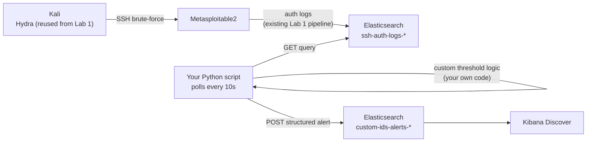

# Lab 5 — Custom Log-Based Intrusion Detection Script

## Lab Overview

**Purpose:** Write your own detection engine from scratch in Python — no Kibana rule builder, no `grok` filter doing the parsing for you — that polls your SIEM for failed SSH logins, applies your own brute-force logic, and pushes a structured alert back into Elasticsearch when it fires.

**Why this matters in real SOC work:** Every SIEM's built-in rule engine is, underneath, just software applying logic like the kind you'll write today — polling data, counting events in a window, comparing against a threshold, emitting an alert. Understanding that isn't academic: real detection engineering teams routinely need custom logic that a vendor's rule builder can't express (cross-referencing threat intel feeds, stateful multi-stage detections, correlating across data sources with incompatible schemas), and the only way to build that is code. This lab also builds a genuinely reusable skill and artifact — the script you write here is a real, portfolio-worthy tool, not just a lab exercise.

**What you'll learn:**
- How to query Elasticsearch's REST API directly from Python, without Logstash or Kibana in the loop
- How to implement a sliding-time-window threshold algorithm yourself — the exact technique Lab 1's Kibana rule was doing for you invisibly
- How to design structured alert output (not just "print a warning" — a real, indexable, queryable document)
- Why alert deduplication/cooldown logic matters the moment you write a detector yourself (Kibana's rule engine handles this for you silently; here, you'll feel what happens when you forget it)

**Detection target:** SSH brute-force patterns already flowing into your SIEM from Lab 1 — this lab reuses that data source and builds an independent, parallel detection path against it.

**Tools used:**

| Tool | Role | Runs on |
|---|---|---|
| Python 3 | Detection script | ELK-SIEM |
| `requests` (Python library) | Talks to Elasticsearch's REST API | ELK-SIEM |
| Hydra | Regenerates a brute-force attack to trigger the script | Kali |

## Architecture for This Lab



This lab runs entirely on top of infrastructure you already built — no new log pipeline. The only new thing is the detection logic itself, and it's yours.

---

## Part 1 — Verify Python 3 and Install Dependencies

SSH into ELK-SIEM (`ssh socadmin@192.168.56.102`).

### 1.1 Confirm Python 3

Ubuntu 22.04 ships with Python 3 by default:

```bash
python3 --version
pip3 --version
```

If `pip3` is missing:

```bash
sudo apt update
sudo apt install -y python3-pip
```

### 1.2 Install the `requests` Library

```bash
pip3 install requests
```

> 📸 **CAPTURE THIS:** Terminal showing `python3 --version` and the successful `pip3 install requests`.
> Save as `lab05-01-python-setup.png` → ``

---

## Part 2 — Understand What You're Building

Before writing code, understand the algorithm in plain terms, since this is the actual learning objective:

1. **Poll**: every 10 seconds, ask Elasticsearch for any `ssh-auth-logs-*` documents with `event_outcome: failure` that arrived since the last time you checked.
2. **Parse**: unlike Lab 2's port-scan pipeline, Lab 1's pipeline never extracted the source IP into its own field — it's still buried in the raw `message` text (`"...Failed password for msfadmin from 192.168.56.101 port..."`). You'll extract it yourself with a regular expression — this is the same job Logstash's `grok` did for you in Lab 2, except now you're the one writing the parser.
3. **Track**: keep an in-memory record of failed-login timestamps per source IP, and discard anything older than a 60-second sliding window.
4. **Detect**: if any single source IP has more than 5 failures inside that live 60-second window, that's a brute-force pattern.
5. **Cooldown**: once you've alerted on a given source IP, don't alert again for it for a few minutes — otherwise you'll flood your alert index with a new document every 10-second poll cycle for as long as the attack continues. (This is a real lesson: this exact problem is why alert fatigue is such a common complaint about badly-tuned detections in production SOCs.)
6. **Alert**: build a structured JSON document (timestamp, source IP, failure count, detection window, severity) and `POST` it directly into a new Elasticsearch index.

---

## Part 3 — Write the Script

```bash
nano ~/detect_bruteforce.py
```

Paste in the following:

```python
#!/usr/bin/env python3
"""
Custom SSH brute-force detector.
Polls Elasticsearch for failed SSH logins, applies a sliding-window
threshold, and posts structured alerts back into a dedicated index.
"""

import requests
import re
import time
import json
from datetime import datetime, timezone, timedelta

ES_HOST = "http://192.168.56.102:9200"
SOURCE_INDEX = "ssh-auth-logs-*"
ALERT_INDEX_PREFIX = "custom-ids-alerts"

POLL_INTERVAL_SECONDS = 10
WINDOW_SECONDS = 60
THRESHOLD = 5
COOLDOWN_SECONDS = 180

IP_REGEX = re.compile(r"from (\d{1,3}\.\d{1,3}\.\d{1,3}\.\d{1,3})")

# In-memory state: {ip: [timestamps]}
failure_windows = {}
# In-memory state: {ip: last_alert_time}
last_alerted = {}

# Track the timestamp of the newest event we've already processed
last_checkpoint = datetime.now(timezone.utc) - timedelta(seconds=WINDOW_SECONDS)


def fetch_new_failures(since):
    """Query Elasticsearch for failed logins newer than `since`."""
    url = f"{ES_HOST}/{SOURCE_INDEX}/_search"
    query = {
        "query": {
            "bool": {
                "must": [
                    {"match": {"event_outcome": "failure"}},
                    {"range": {"@timestamp": {"gt": since.isoformat()}}}
                ]
            }
        },
        "sort": [{"@timestamp": "asc"}],
        "size": 200
    }
    resp = requests.post(url, json=query, timeout=10)
    resp.raise_for_status()
    return resp.json()["hits"]["hits"]


def extract_ip(message):
    match = IP_REGEX.search(message)
    return match.group(1) if match else None


def prune_old_entries(ip, now):
    cutoff = now - timedelta(seconds=WINDOW_SECONDS)
    failure_windows[ip] = [ts for ts in failure_windows[ip] if ts > cutoff]


def send_alert(ip, count, now):
    alert_doc = {
        "@timestamp": now.isoformat(),
        "alert_type": "ssh_brute_force",
        "source_ip": ip,
        "failure_count": count,
        "window_seconds": WINDOW_SECONDS,
        "severity": "high",
        "detector": "custom_python_script"
    }
    index_name = f"{ALERT_INDEX_PREFIX}-{now.strftime('%Y.%m.%d')}"
    url = f"{ES_HOST}/{index_name}/_doc"
    resp = requests.post(url, json=alert_doc, timeout=10)
    resp.raise_for_status()
    print(f"[ALERT SENT] {ip} — {count} failures in {WINDOW_SECONDS}s — {resp.json()['_id']}")


def main():
    global last_checkpoint
    print(f"Starting custom brute-force detector. Polling every {POLL_INTERVAL_SECONDS}s...")

    while True:
        try:
            hits = fetch_new_failures(last_checkpoint)
            now = datetime.now(timezone.utc)

            for hit in hits:
                source = hit["_source"]
                message = source.get("message", "")
                event_time_str = source.get("@timestamp")
                ip = extract_ip(message)

                if not ip:
                    continue

                event_time = datetime.fromisoformat(event_time_str.replace("Z", "+00:00"))
                failure_windows.setdefault(ip, []).append(event_time)
                last_checkpoint = max(last_checkpoint, event_time)

            for ip in list(failure_windows.keys()):
                prune_old_entries(ip, now)
                count = len(failure_windows[ip])

                if count > THRESHOLD:
                    cooldown_expired = (
                        ip not in last_alerted
                        or (now - last_alerted[ip]).total_seconds() > COOLDOWN_SECONDS
                    )
                    if cooldown_expired:
                        send_alert(ip, count, now)
                        last_alerted[ip] = now
                    else:
                        print(f"[SUPPRESSED] {ip} — {count} failures, still in cooldown")

            print(f"[{now.isoformat()}] Poll complete. Tracking {len(failure_windows)} source IP(s).")

        except requests.exceptions.RequestException as e:
            print(f"[ERROR] Elasticsearch request failed: {e}")

        time.sleep(POLL_INTERVAL_SECONDS)


if __name__ == "__main__":
    main()
```

Save and exit.

> 📸 **CAPTURE THIS:** No screenshot needed here — you'll capture the script running in the next part.

---

## Part 4 — Run the Detector

```bash
python3 ~/detect_bruteforce.py
```

Leave it running. You should see it print a "Poll complete" line every 10 seconds, even with nothing happening yet.

> 📸 **CAPTURE THIS:** Terminal showing the script running with a few idle poll cycles.
> Save as `lab05-02-detector-running-idle.png` → ``

---

## Part 5 — Trigger It

In a **separate terminal**, on Kali, reuse Lab 1's attack exactly as before:

```bash
hydra -l msfadmin -P ~/passwords.txt ssh://192.168.56.103 -t 4 -f
```

(If you deleted `~/passwords.txt`, recreate it per Lab 1 Part 6.1.)

Watch your ELK-SIEM terminal — within one or two poll cycles after the attack lands, you should see:

```
[ALERT SENT] 192.168.56.101 — 6 failures in 60s — <document id>
```

> 📸 **CAPTURE THIS:** Terminal showing the `[ALERT SENT]` line firing.
> Save as `lab05-03-alert-sent.png` → ``

**Run Hydra a second time immediately after**, without waiting — you should now see `[SUPPRESSED] ... still in cooldown` instead of a second alert. This confirms your cooldown logic is doing its job.

> 📸 **CAPTURE THIS:** Terminal showing a `[SUPPRESSED]` line on the second attack run.
> Save as `lab05-04-cooldown-suppression.png` → ``

---

## Part 6 — Verify the Alert in Elasticsearch and Kibana

### 6.1 Confirm via curl

In a third terminal on ELK-SIEM (leave the detector running in its own tab):

```bash
curl "http://192.168.56.102:9200/custom-ids-alerts-*/_search?pretty"
```

You should see your structured alert document with all the fields your script built.

> 📸 **CAPTURE THIS:** This `curl` output.
> Save as `lab05-05-alert-in-elasticsearch.png` → ``

### 6.2 Create a Kibana Data View

Browser: `http://192.168.56.102:5601` → **Stack Management → Data Views → Create data view**

- Name: `Custom IDS Alerts`
- Index pattern: `custom-ids-alerts-*`
- Timestamp field: `@timestamp`
- **Save**

### 6.3 View It in Discover

**Discover** → select `Custom IDS Alerts` → confirm your alert document is visible with all its fields.

> 📸 **CAPTURE THIS:** Kibana Discover showing the alert document.
> Save as `lab05-06-kibana-custom-alert.png` → ``

---

## Part 7 — (Optional) Run It as a Persistent Service

Right now, your detector dies the moment you close the terminal or log out. A real deployment would run it as a background service. This step is optional but recommended if you want the full experience of deploying a custom tool, not just running it interactively.

```bash
sudo nano /etc/systemd/system/bruteforce-detector.service
```

```ini
[Unit]
Description=Custom SSH Brute-Force Detector
After=network.target elasticsearch.service

[Service]
Type=simple
ExecStart=/usr/bin/python3 /home/socadmin/detect_bruteforce.py
Restart=on-failure
User=socadmin

[Install]
WantedBy=multi-user.target
```

Save, then:

```bash
sudo systemctl daemon-reload
sudo systemctl enable --now bruteforce-detector
sudo systemctl status bruteforce-detector --no-pager
```

Watch it logging to the systemd journal instead of your terminal now:

```bash
sudo journalctl -u bruteforce-detector -f
```

(Press `Ctrl+C` to stop following the log — the service keeps running in the background either way.)

> 📸 **CAPTURE THIS:** Terminal showing the service active and journal output.
> Save as `lab05-07-systemd-service-running.png` → ``

---

## Part 8 — Document the Finding

- [`Lab5-Investigation-Writeup-Template.docx`](./Lab5-Investigation-Writeup-Template.docx) — the clean, fillable Word document. No instructions inside it.
- [`WRITEUP-TEMPLATE.md`](./WRITEUP-TEMPLATE.md) — a guide explaining exactly where in this lab to find the information each field is asking for.

---

## Media Checklist for This Lab

| Filename | What it shows |
|---|---|
| `lab05-01-python-setup.png` | Python 3 and `requests` verified/installed |
| `lab05-02-detector-running-idle.png` | Detector script running, idle poll cycles |
| `lab05-03-alert-sent.png` | `[ALERT SENT]` line firing during attack |
| `lab05-04-cooldown-suppression.png` | `[SUPPRESSED]` line confirming cooldown logic |
| `lab05-05-alert-in-elasticsearch.png` | Alert document confirmed in Elasticsearch |
| `lab05-06-kibana-custom-alert.png` | Alert visible in Kibana Discover |
| `lab05-07-systemd-service-running.png` | Detector running as a systemd service (optional) |

## Troubleshooting

- **Script exits immediately with `ModuleNotFoundError: No module named 'requests'`:** re-run `pip3 install requests` — if you're using a virtual environment or a different Python interpreter than expected, confirm with `which python3` and `pip3 show requests`.
- **Script runs but never prints `[ALERT SENT]` even after a Hydra attack:** add a temporary `print(ip, len(failure_windows.get(ip, [])))` line inside the `for ip in list(failure_windows.keys())` loop to see what it's actually counting — the most common cause is the regex not matching your log line format. Compare `IP_REGEX` against an actual raw `message` field value (`curl "http://192.168.56.102:9200/ssh-auth-logs-*/_search?pretty&q=message:Failed"` and inspect the `message` text closely).
- **`requests.exceptions.ConnectionError`:** confirm Elasticsearch is actually running (`curl http://192.168.56.102:9200` in a separate terminal) before assuming the script is broken.
- **Every poll cycle re-alerts on the same old attack, ignoring cooldown:** double-check your system clock — if `datetime.now(timezone.utc)` is producing inconsistent values (e.g. after a VM was paused/resumed), the cooldown math can misbehave. Restarting the script resets its in-memory state cleanly if this happens.
- **systemd service fails to start:** check `sudo journalctl -u bruteforce-detector -n 50 --no-pager` for the real error — common causes are an incorrect path in `ExecStart` (confirm with `realpath ~/detect_bruteforce.py`) or the `User=` line not matching your actual username.

## Completion Checklist

- [ ] Python 3 and `requests` verified/installed on ELK-SIEM
- [ ] Detection script written and understood (not just copy-pasted — you can explain each part)
- [ ] Script runs and idles cleanly with no attack happening
- [ ] Hydra attack triggers a real `[ALERT SENT]` line
- [ ] Second immediate attack correctly triggers `[SUPPRESSED]` (cooldown working)
- [ ] Alert confirmed in Elasticsearch via `curl`
- [ ] Kibana data view created and alert visible in Discover
- [ ] (Optional) Script deployed as a systemd service
- [ ] All 6–7 screenshots captured and named per convention
- [ ] Investigation write-up completed using the template

Once every box is checked, you're ready for **Lab 6 — Beaconing Traffic Detection Lab**.
