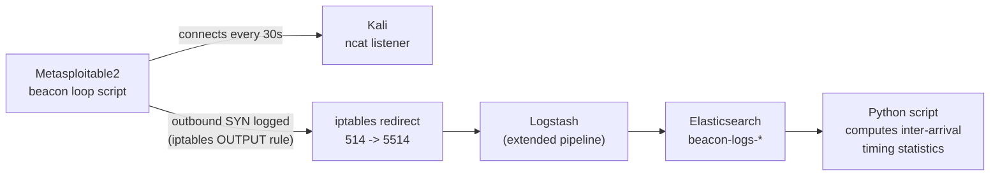

# Lab 6 — Beaconing Traffic Detection Lab

## Lab Overview

**Purpose:** Simulate periodic command-and-control "check-in" traffic, then build detection logic based on **timing regularity** rather than volume, content, or direction — the three techniques every prior lab has relied on. This is the detection method that catches C2 traffic no signature or threshold-on-count rule ever will.

**Why this matters in real SOC work:** Real malware beacons deliberately try to look boring — one small connection every N seconds/minutes, blending into background noise, using common ports, sometimes even mimicking legitimate protocols. Volume-based detection (Lab 2's approach) is useless against this, because beacons are low-volume by design. What gives them away is what a human can't easily fake: **near-perfect regularity**. A person browsing the web generates wildly irregular connection timing; a script checking in every 30 seconds does not. Learning to measure and act on that regularity — rather than just staring at a packet list hoping something looks "off" — is a genuinely advanced SOC skill, and one most junior analysts never get taught explicitly.

**What you'll learn:**
- How to simulate realistic beaconing behavior for testing detection logic
- How to measure timing regularity statistically (using standard deviation of inter-arrival times), rather than eyeballing a graph
- Why this technique needs a *comparison* against normal traffic to mean anything — regularity alone isn't suspicious without knowing what irregular looks like in your environment
- How to extend a data pipeline (Lab 2's `iptables`/Logstash infrastructure) to a new detection use case without rebuilding it

**Simulated technique:** A scripted loop connecting from Metasploitable2 to Kali every 30 seconds, mimicking C2 check-in behavior.

**Tools used:**

| Tool | Role | Runs on |
|---|---|---|
| Netcat / Ncat | Generates the beacon traffic and receives it | Both machines |
| Wireshark | Visual confirmation of timing regularity | Kali |
| iptables + Logstash | Logs each beacon connection (reuses Lab 2's pipeline) | Metasploitable2 / ELK-SIEM |
| Python | Statistical beacon-detection script (extends Lab 5) | ELK-SIEM |

## Architecture for This Lab



---

## Part 1 — Verify Ncat on Kali

We use `ncat` specifically (bundled with Nmap) rather than plain `nc`, because it reliably supports `-k` (keep listening after a client disconnects) across Kali installs — plain Netcat's support for this varies by build.

```bash
which ncat
ncat --version
```

If missing (unlikely, since it ships with Nmap):

```bash
sudo apt install -y ncat
```

> 📸 **CAPTURE THIS:** Terminal showing `ncat --version`.
> Save as `lab06-01-ncat-verify.png` → ``

---

## Part 2 — Simulate Beaconing Traffic

### 2.1 Start the Listener on Kali

```bash
ncat -lvk 5555
```

- `-l` — listen
- `-v` — verbose
- `-k` — keep listening after each client disconnects (critical — without this, the listener would die after the first beacon)

Leave this running in its own terminal tab.

### 2.2 Write the Beacon Script on Metasploitable2

```bash
ssh metasploitable
export TERM=xterm
nano ~/beacon.sh
```

```bash
#!/bin/bash
# Simulated C2 beacon: connects out and sends a short check-in every 30 seconds
while true; do
    echo "beacon check-in from $(hostname) at $(date)" | nc -w 2 192.168.56.101 5555
    sleep 30
done
```

Save, then make it executable and run it:

```bash
chmod +x ~/beacon.sh
./beacon.sh
```

Leave this running too. Switch back to your Kali listener tab — you should see a new "check-in" message arrive every 30 seconds.

> 📸 **CAPTURE THIS:** Kali terminal showing at least 3–4 beacon check-ins arriving over time (wait ~2 minutes).
> Save as `lab06-02-beacon-checkins-arriving.png` → ``

---

## Part 3 — Capture and Visually Confirm in Wireshark

### 3.1 Start a Capture

```bash
sudo wireshark
```

Interface `eth0`, capture filter `host 192.168.56.103`, **Start**. Let it run for at least 5 minutes (10 beacon cycles) to get a meaningful sample.

### 3.2 Filter and Inspect Timing

Display filter:

```
tcp.port == 5555
```

### 3.3 Use the IO Graph

**Statistics → I/O Graph**. You should see a strikingly regular pattern — evenly spaced spikes, roughly 30 seconds apart, unlike the bursty, irregular pattern of interactive traffic from Lab 3.

> 📸 **CAPTURE THIS:** The Wireshark I/O Graph showing the regular beacon spikes.
> Save as `lab06-03-wireshark-io-graph-beacon.png` → ``

Stop and save the capture: **File → Save As** → `lab6-beacon-capture.pcapng`.

---

## Part 4 — Extend the Detection Pipeline

We're reusing Lab 2's `iptables`/Logstash infrastructure, extending it to a new use case rather than building anything from scratch.

### 4.1 Add an OUTPUT Logging Rule on Metasploitable2

Lab 2's rule logged **inbound** connections (`INPUT` chain, for detecting port scans against this machine). Beaconing is the opposite direction — this machine calling **out** — so we need an `OUTPUT` rule instead:

```bash
sudo iptables -A OUTPUT -p tcp --syn -d 192.168.56.101 -j LOG --log-prefix "BEACON_OUT: " --log-level 4
```

This only logs outbound connection attempts specifically toward Kali (`-d 192.168.56.101`), keeping the log focused on what we actually care about.

Confirm it:

```bash
sudo iptables -L OUTPUT -v -n
```

> 📸 **CAPTURE THIS:** Terminal showing the OUTPUT chain LOG rule.
> Save as `lab06-04-iptables-output-rule.png` → ``

The `kern.*` syslog forwarding from Lab 2 already covers this — no changes needed there.

### 4.2 Extend the Logstash Pipeline

On ELK-SIEM:

```bash
sudo nano /etc/logstash/conf.d/ssh-auth-pipeline.conf
```

Add a new branch for beacon events. The full `filter`/`output` blocks should now read:

```
filter {
  if "SCAN_PROBE:" in [message] {
    grok {
      match => { "message" => "SRC=%{IP:src_ip} DST=%{IP:dst_ip} LEN=%{INT:pkt_len} TOS=%{DATA:tos} PREC=%{DATA:prec} TTL=%{INT:ttl} ID=%{INT:pkt_id}.*PROTO=%{WORD:l4_proto} SPT=%{INT:src_port} DPT=%{INT:dst_port}" }
    }
    mutate { add_field => { "event_type" => "port_scan" } }
  } else if "BEACON_OUT:" in [message] {
    grok {
      match => { "message" => "SRC=%{IP:src_ip} DST=%{IP:dst_ip} LEN=%{INT:pkt_len} TOS=%{DATA:tos} PREC=%{DATA:prec} TTL=%{INT:ttl} ID=%{INT:pkt_id}.*PROTO=%{WORD:l4_proto} SPT=%{INT:src_port} DPT=%{INT:dst_port}" }
    }
    mutate { add_field => { "event_type" => "beacon" } }
  } else if "Failed password" in [message] {
    mutate { add_field => { "event_outcome" => "failure" } }
  } else if "Accepted password" in [message] {
    mutate { add_field => { "event_outcome" => "success" } }
  }
}

output {
  if [event_type] == "port_scan" {
    elasticsearch {
      hosts => ["http://192.168.56.102:9200"]
      index => "portscan-logs-%{+YYYY.MM.dd}"
    }
  } else if [event_type] == "beacon" {
    elasticsearch {
      hosts => ["http://192.168.56.102:9200"]
      index => "beacon-logs-%{+YYYY.MM.dd}"
    }
  } else {
    elasticsearch {
      hosts => ["http://192.168.56.102:9200"]
      index => "ssh-auth-logs-%{+YYYY.MM.dd}"
    }
  }
  stdout { codec => rubydebug }
}
```

(The `input` block at the top of the file stays exactly as it was — only `filter` and `output` change.)

Save and restart:

```bash
sudo systemctl restart logstash
sleep 20
```

### 4.3 Verify Beacon Events Are Being Captured

With your beacon script still running on Metasploitable2, wait a minute or two, then on ELK-SIEM:

```bash
curl "http://192.168.56.102:9200/beacon-logs-*/_search?pretty&size=5&sort=@timestamp:desc"
```

You should see parsed events with `event_type: beacon` and populated `src_ip`/`dst_port` fields.

> 📸 **CAPTURE THIS:** This `curl` output showing parsed beacon events.
> Save as `lab06-05-beacon-events-elasticsearch.png` → ``

---

## Part 5 — Write the Timing-Analysis Script

This is the actual detection logic — a small standalone Python script, run manually (not as a service, to keep this lab focused on the analysis technique itself).

On ELK-SIEM:

```bash
nano ~/analyze_beaconing.py
```

```python
#!/usr/bin/env python3
"""
Beacon timing analyzer.
Pulls recent events for a given source IP from Elasticsearch, computes the
time gaps between consecutive events, and flags low-variance (regular)
timing as likely beaconing.
"""

import requests
import statistics
import sys
import re
from datetime import datetime

ES_HOST = "http://192.168.56.102:9200"


def parse_es_timestamp(ts_str):
    """Elasticsearch returns nanosecond-precision timestamps; Python's
    datetime.fromisoformat() only supports up to microseconds (6 digits).
    Truncate any extra precision before parsing. (Same fix as Lab 5.)"""
    ts_str = ts_str.replace("Z", "+00:00")
    match = re.match(r"(.*\.\d{6})\d*(\+\d{2}:\d{2})", ts_str)
    if match:
        ts_str = match.group(1) + match.group(2)
    return datetime.fromisoformat(ts_str)


def fetch_events(index, source_ip, size=100):
    url = f"{ES_HOST}/{index}/_search"
    query = {
        "query": {"match": {"src_ip": source_ip}},
        "sort": [{"@timestamp": "asc"}],
        "size": size
    }
    resp = requests.post(url, json=query, timeout=10)
    resp.raise_for_status()
    return [hit["_source"]["@timestamp"] for hit in resp.json()["hits"]["hits"]]


def analyze(index, source_ip):
    timestamps_raw = fetch_events(index, source_ip)
    if len(timestamps_raw) < 3:
        print(f"Not enough events ({len(timestamps_raw)}) to analyze timing for {source_ip}.")
        return

    timestamps = sorted(parse_es_timestamp(ts) for ts in timestamps_raw)
    gaps = [
        (timestamps[i] - timestamps[i - 1]).total_seconds()
        for i in range(1, len(timestamps))
    ]

    mean_gap = statistics.mean(gaps)
    stdev_gap = statistics.stdev(gaps) if len(gaps) > 1 else 0
    coefficient_of_variation = (stdev_gap / mean_gap) if mean_gap > 0 else 0

    print(f"\nSource IP: {source_ip}")
    print(f"Events analyzed: {len(timestamps)}")
    print(f"Inter-arrival gaps (seconds): {[round(g, 1) for g in gaps]}")
    print(f"Mean gap: {mean_gap:.2f}s")
    print(f"Standard deviation: {stdev_gap:.2f}s")
    print(f"Coefficient of variation: {coefficient_of_variation:.3f}")

    # A low coefficient of variation means the timing is very regular —
    # human/organic traffic typically scores well above 0.5; a scripted
    # beacon typically scores well under 0.15.
    if coefficient_of_variation < 0.15:
        print("VERDICT: Highly regular timing — consistent with automated beaconing.")
    elif coefficient_of_variation < 0.5:
        print("VERDICT: Moderately regular — worth further investigation.")
    else:
        print("VERDICT: Irregular timing — consistent with normal human/organic traffic.")


if __name__ == "__main__":
    if len(sys.argv) != 3:
        print("Usage: python3 analyze_beaconing.py <index> <source_ip>")
        print("Example: python3 analyze_beaconing.py beacon-logs-* 192.168.56.103")
        sys.exit(1)

    analyze(sys.argv[1], sys.argv[2])
```

Save and run it against your beacon traffic:

```bash
python3 ~/analyze_beaconing.py "beacon-logs-*" 192.168.56.103
```

You should see a **VERDICT: Highly regular timing** result, with a coefficient of variation well under 0.15 (your beacon's 30-second interval should be extremely consistent).

> 📸 **CAPTURE THIS:** Terminal showing the script's full output and verdict for the beacon traffic.
> Save as `lab06-06-beacon-analysis-verdict.png` → ``

---

## Part 6 — Prove It Against Normal Traffic (False Positive Check)

A regularity detector is meaningless without confirming it *doesn't* flag ordinary traffic. Generate some deliberately irregular connections to compare against.

### 6.1 Stop the Beacon Script

Back in your Metasploitable2 terminal running `beacon.sh`, press `Ctrl+C`.

### 6.2 Generate Irregular Traffic

```bash
for i in 1 2 3 4 5 6; do
    echo "irregular check-in $i" | nc -w 2 192.168.56.101 5555
    sleep $((RANDOM % 40 + 5))
done
```

This connects 6 times with a random 5–45 second gap between each — mimicking unpredictable human/application behavior rather than a fixed script interval.

### 6.3 Analyze It the Same Way

Once this finishes (this will take several minutes — that's expected), re-run the analyzer:

```bash
python3 ~/analyze_beaconing.py "beacon-logs-*" 192.168.56.103
```

**Note:** this will actually analyze the **combined** dataset (your earlier beacon traffic plus this new irregular traffic), since both used the same index and destination — that's fine for this comparison, but be aware of it when interpreting the result and writing up your findings. For a cleaner side-by-side comparison, you could adjust the script to filter by a time range covering only the irregular-traffic window.

> 📸 **CAPTURE THIS:** Terminal showing this second analysis run and its (likely less confident, or mixed) verdict.
> Save as `lab06-07-irregular-traffic-verdict.png` → ``

---

## Part 7 — Document the Finding

- [`Lab6-Investigation-Writeup-Template.docx`](./Lab6-Investigation-Writeup-Template.docx) — the clean, fillable Word document. No instructions inside it.
- [`WRITEUP-TEMPLATE.md`](./WRITEUP-TEMPLATE.md) — a guide explaining exactly where in this lab to find the information each field is asking for.

---

## Media Checklist for This Lab

| Filename | What it shows |
|---|---|
| `lab06-01-ncat-verify.png` | Ncat verified on Kali |
| `lab06-02-beacon-checkins-arriving.png` | Beacon check-ins arriving on schedule |
| `lab06-03-wireshark-io-graph-beacon.png` | Regular timing visible in Wireshark I/O Graph |
| `lab06-04-iptables-output-rule.png` | iptables OUTPUT logging rule added |
| `lab06-05-beacon-events-elasticsearch.png` | Parsed beacon events in Elasticsearch |
| `lab06-06-beacon-analysis-verdict.png` | Timing analysis script's beacon verdict |
| `lab06-07-irregular-traffic-verdict.png` | Comparison verdict against irregular traffic |

## Troubleshooting

- **`ncat -lvk` doesn't seem to accept repeat connections:** double-check you used `ncat`, not plain `nc` — this is exactly the capability gap this lab's Part 1 called out.
- **`nano` fails with `Error opening terminal` on Metasploitable2:** run `export TERM=xterm` first — see Lab 1 Part 4.1.
- **No beacon events reaching Elasticsearch:** confirm the `OUTPUT` chain rule exists (`sudo iptables -L OUTPUT -v -n`, distinct from Lab 2's `INPUT` rule), and that the Logstash pipeline restarted cleanly after the Part 4.2 edit (`sudo systemctl status logstash`).
- **Analyzer script errors with "Not enough events":** you need at least 3 beacon check-ins logged before there's enough data for two gaps to compute a standard deviation from — let the beacon run longer before analyzing.
- **Coefficient of variation for the beacon isn't as low as expected:** minor timing jitter from `nc -w 2`'s connection overhead is normal and won't meaningfully affect the result; if it's wildly irregular, confirm `sleep 30` wasn't accidentally edited to something randomized in your script.

## Completion Checklist

- [ ] Ncat verified on Kali
- [ ] Beacon script written and running, check-ins confirmed arriving every 30s
- [ ] Wireshark capture showing regular I/O Graph pattern
- [ ] iptables OUTPUT logging rule added and confirmed
- [ ] Logstash pipeline extended, beacon events confirmed parsed in Elasticsearch
- [ ] Timing analysis script written and run against beacon traffic (regular verdict)
- [ ] Irregular traffic generated and analyzed for comparison
- [ ] All 7 screenshots captured and named per convention
- [ ] Both `.pcapng` file and script saved
- [ ] Investigation write-up completed using the template

Once every box is checked, you're ready for **Lab 7 — Exploitation Visibility Analysis**.
