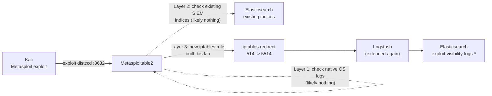
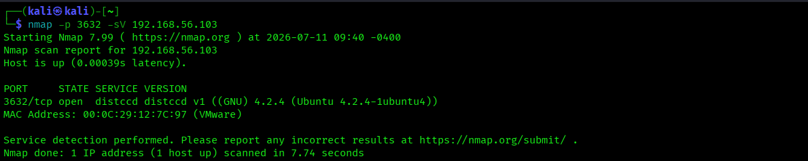
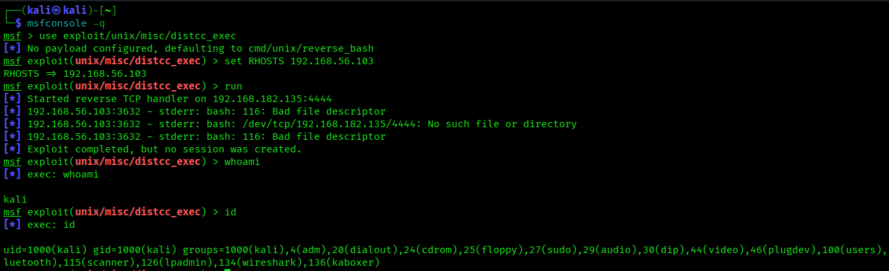
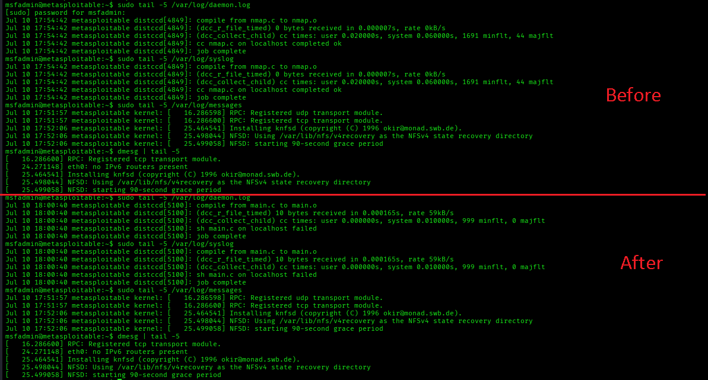
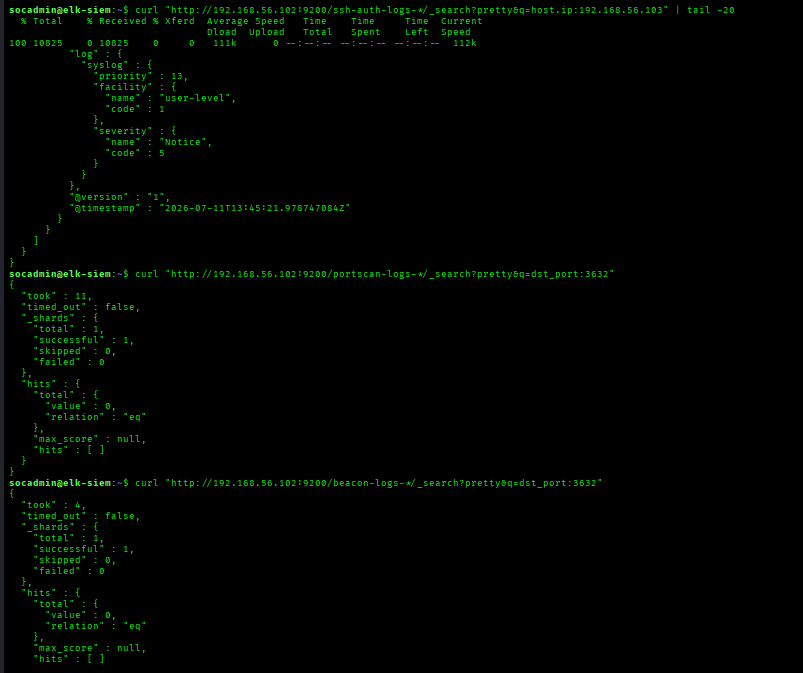
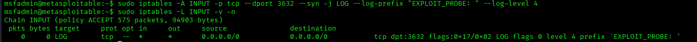
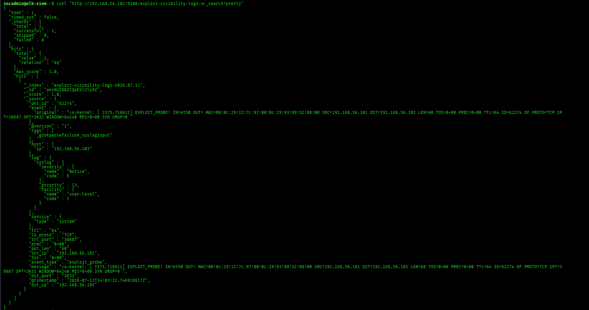

# Lab 7 — Exploitation Visibility Analysis

## Lab Overview

**Purpose:** Exploit a real vulnerable service, then systematically compare three separate layers of visibility for that exact same event: what the target's own operating system logged (often nothing at all), what your existing SIEM pipelines caught by default (also often nothing, since none of them were built for this), and finally what you can deliberately build to close that gap. This turns a theme Labs 3 and 4 already hinted at — "some things are just invisible" — into a repeatable, structured methodology you can apply to any technology, not just the ones this course happens to cover.

**Why this matters in real SOC work:** Identifying and articulating monitoring gaps is one of the most valuable, least-taught skills in SOC work. Most junior training focuses entirely on responding to alerts that already exist. But real SOC maturity work — the kind that gets a security program taken seriously by leadership — is proactively answering "if this exact attack happened to us right now, would we actually catch it, and at which layer?" This lab gives you a repeatable three-question framework for answering that: **(1) Does the technology itself log this? (2) Is that log actually flowing into our SIEM? (3) If not, what would it take to build that visibility?** Every mature detection engineering team asks these three questions constantly; this lab is your first structured rehearsal of doing it yourself.

**Exploitation target:** `distccd` (the distributed compilation daemon) running on port 3632 — a different, still-classic Metasploitable2 vulnerability from Lab 4's `vsftpd` backdoor, chosen specifically because it has essentially **no native application logging**, making the visibility gap especially stark and easy to observe directly.

**Tools used:**

| Tool | Role | Runs on |
|---|---|---|
| Nmap | Confirm the target service | Kali |
| Metasploit | Exploit `distccd` | Kali |
| iptables + Logstash | Build the purpose-built detection (Layer 3) | Metasploitable2 / ELK-SIEM |

## Architecture for This Lab



---

## Part 1 — Confirm the Target Service

From Kali:

```bash
nmap -p 3632 -sV 192.168.56.103
```

You should see:

```
3632/tcp open  distccd     distccd v1 ((GNU) 4.2.4)
```



---

## Part 2 — Layer 1: Check the Target's Native Logs (Before and After)

### 2.1 Baseline — Check Before Exploiting

SSH into Metasploitable2 (`ssh metasploitable`) and check every plausible log location **before** touching the exploit, so you have a clean "before" state to compare against:

```bash
export TERM=xterm
sudo tail -5 /var/log/daemon.log
sudo tail -5 /var/log/syslog
sudo tail -5 /var/log/messages
dmesg | tail -5
```

Note roughly how many lines are in each right now (or just note the last timestamp) — you'll compare against this after the exploit.

### 2.2 Run the Exploit from Kali

```bash
msfconsole -q
use exploit/unix/misc/distcc_exec
set RHOSTS 192.168.56.103
run
```

You should land in a shell (running as user `daemon`, not root — a lower-privilege foothold than Lab 4's backdoor, which is realistic; not every exploit hands over full control immediately).

```bash
whoami
id
```



### 2.3 Check the Same Logs Again — This Is the Actual Finding

Open a **separate** SSH session to Metasploitable2 (leave your exploited shell running) and re-check the exact same four locations:

```bash
export TERM=xterm
sudo tail -5 /var/log/daemon.log
sudo tail -5 /var/log/syslog
sudo tail -5 /var/log/messages
dmesg | tail -5
```

**In almost every case, none of these will show anything related to the exploitation** — no new lines, no timestamp change corresponding to when you ran the exploit. `distccd` on this build simply doesn't log incoming build requests in any of the places a first responder would normally check.



**This is Layer 1's finding: the technology itself provides zero native visibility into this exploitation technique.**

---

## Part 3 — Layer 2: Check What Your Existing SIEM Pipelines Caught

You've now built three separate log pipelines across this course — check all of them for anything related to this exploitation.

On ELK-SIEM:

```bash
curl "http://192.168.56.102:9200/ssh-auth-logs-*/_search?pretty&q=host.ip:192.168.56.103" | tail -20
curl "http://192.168.56.102:9200/portscan-logs-*/_search?pretty&q=dst_port:3632"
curl "http://192.168.56.102:9200/beacon-logs-*/_search?pretty&q=dst_port:3632"
```

**None of these will show anything from the actual exploitation.** The SSH pipeline only ever sees SSH auth events; the port-scan pipeline only fires on the specific `INPUT` chain rule from Lab 2 (which never logged port 3632 specifically); the beacon pipeline only watches outbound connections *to* Kali, not inbound exploitation attempts on this port.



**This is Layer 2's finding: even with three working detection pipelines already built, none of them happened to cover this specific technique. Detection coverage isn't automatically comprehensive just because *some* detections exist.**

---

## Part 4 — Layer 3: Build the Purpose-Built Detection

Now close at least part of the gap — you can't retroactively add application-level logging to `distccd` without modifying Metasploitable2 (which we don't do), but you **can** build network-layer visibility using the same technique from Labs 2 and 6.

### 4.1 Add an iptables Rule for Port 3632

On Metasploitable2:

```bash
sudo iptables -A INPUT -p tcp --dport 3632 --syn -j LOG --log-prefix "EXPLOIT_PROBE: " --log-level 4
```

Confirm:

```bash
sudo iptables -L INPUT -v -n
```



### 4.2 Extend the Logstash Pipeline Again

On ELK-SIEM:

```bash
sudo nano /etc/logstash/conf.d/ssh-auth-pipeline.conf
```

Add a fourth branch. The full `filter`/`output` blocks should now read:

```
filter {
  if "SCAN_PROBE:" in [message] {
    grok {
      match => { "message" => "SRC=%{IP:src_ip} DST=%{IP:dst_ip} LEN=%{INT:pkt_len} TOS=%{DATA:tos} PREC=%{DATA:prec} TTL=%{INT:ttl} ID=%{INT:pkt_id}.*PROTO=%{WORD:l4_proto} SPT=%{INT:src_port} DPT=%{INT:dst_port}" }
    }
    mutate { add_field => { "event_type" => "port_scan" } }
  } else if "BEACON_OUT:" in [message] {
    grok {
      match => { "message" => "SRC=%{IP:src_ip} DST=%{IP:dst_ip} LEN=%{INT:pkt_len} TOS=%{DATA:tos} PREC=%{DATA:prec} TTL=%{INT:ttl} ID=%{INT:pkt_id}.*PROTO=%{WORD:l4_proto} SPT=%{INT:src_port} DPT=%{INT:dst_port}" }
    }
    mutate { add_field => { "event_type" => "beacon" } }
  } else if "EXPLOIT_PROBE:" in [message] {
    grok {
      match => { "message" => "SRC=%{IP:src_ip} DST=%{IP:dst_ip} LEN=%{INT:pkt_len} TOS=%{DATA:tos} PREC=%{DATA:prec} TTL=%{INT:ttl} ID=%{INT:pkt_id}.*PROTO=%{WORD:l4_proto} SPT=%{INT:src_port} DPT=%{INT:dst_port}" }
    }
    mutate { add_field => { "event_type" => "exploit_probe" } }
  } else if "Failed password" in [message] {
    mutate { add_field => { "event_outcome" => "failure" } }
  } else if "Accepted password" in [message] {
    mutate { add_field => { "event_outcome" => "success" } }
  }
}

output {
  if [event_type] == "port_scan" {
    elasticsearch {
      hosts => ["http://192.168.56.102:9200"]
      index => "portscan-logs-%{+YYYY.MM.dd}"
    }
  } else if [event_type] == "beacon" {
    elasticsearch {
      hosts => ["http://192.168.56.102:9200"]
      index => "beacon-logs-%{+YYYY.MM.dd}"
    }
  } else if [event_type] == "exploit_probe" {
    elasticsearch {
      hosts => ["http://192.168.56.102:9200"]
      index => "exploit-visibility-logs-%{+YYYY.MM.dd}"
    }
  } else {
    elasticsearch {
      hosts => ["http://192.168.56.102:9200"]
      index => "ssh-auth-logs-%{+YYYY.MM.dd}"
    }
  }
  stdout { codec => rubydebug }
}
```

Save and restart:

```bash
sudo systemctl restart logstash
sleep 20
```

### 4.3 Re-Run the Exploit and Confirm the New Detection Catches It

Back on Kali (a fresh `msfconsole` session, since your old one may have timed out):

```bash
msfconsole -q
use exploit/unix/misc/distcc_exec
set RHOSTS 192.168.56.103
run
```

On ELK-SIEM:

```bash
curl "http://192.168.56.102:9200/exploit-visibility-logs-*/_search?pretty"
```

You should now see a parsed event with `dst_port: 3632` and `event_type: exploit_probe`.



**An important note for your investigation, detective!:** this closes the gap only partially. You now know a connection attempt happened on port 3632 — but you still have **zero visibility into what command was actually executed** once the exploit succeeded. Network-layer visibility and application-layer/content visibility are two different problems; this lab only solved the first one. Say this explicitly in your findings — recognizing the limits of a fix you just built is exactly the kind of honest, mature analysis a real security assessment requires.

---

## Part 5 — Build the Three-Layer Comparison Table

This is the lab's actual deliverable — pulling Parts 2–4 together into one comparison:

| Layer | Question | Finding |
|---|---|---|
| 1 — Native logging | Does `distccd` itself log this activity? | No — checked `daemon.log`, `syslog`, `messages`, and `dmesg`; no related entries appeared |
| 2 — Existing SIEM coverage | Did any of the three pipelines already built (Labs 1/2/6) catch this? | No — none of them were built to monitor port 3632 |
| 3 — Purpose-built detection | Can new visibility be engineered? | Partially — network-layer connection attempts are now visible, but command execution content is still completely invisible |

---

## Part 6 — Document the Finding

- [`Lab7-Investigation-Writeup-Template.docx`](./Lab7-Investigation-Writeup-Template.docx) — the clean, fillable Word document. No instructions inside it.
- [`WRITEUP-TEMPLATE.md`](./WRITEUP-TEMPLATE.md) — a guide explaining exactly where in this lab to find the information each field is asking for.

---

**Attention!!:** Don't worry, you're doing great, and you're journey is approaching towards a conclusion. You are filled with determination!.

---

## Troubleshooting

- **`distcc_exec` exploit fails or times out:** confirm the service is actually reachable first (Part 1's Nmap scan) — if `distccd` doesn't show as open, check `sudo iptables -L INPUT -v -n` on Metasploitable2 doesn't have a rule inadvertently blocking it (none of this course's rules should, but worth a check if something else was changed).
- **`nano`/log commands fail with terminal errors on Metasploitable2:** run `export TERM=xterm` first — see Lab 1 Part 4.1.
- **No events reaching `exploit-visibility-logs-*` after Part 4:** confirm Logstash restarted cleanly (`sudo systemctl status logstash --no-pager`) and that the `iptables` rule from 4.1 is actually present (`sudo iptables -L INPUT -v -n` — check the packet counter increments after you re-run the exploit).
- **You find something unexpected in one of the "before/after" log checks in Part 2:** don't discard it — a genuinely unexpected finding (e.g. a generic connection log unrelated to distcc specifically) is worth noting in your write-up too. The goal is accurate observation, not confirming a pre-written conclusion.
