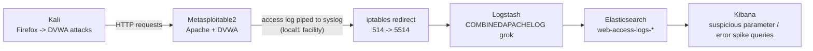

# Lab 8 — Web Attack Detection in SIEM

## Lab Overview

**Purpose:** Simulate common web application attacks — SQL injection, reflected XSS, and directory traversal — against a real vulnerable web app, then build SIEM detection queries for suspicious parameters, HTTP error spikes, and encoded payloads.

**Why this matters in real SOC work:** Web applications are the most consistently attacked surface in almost any organization — they're internet-facing by definition, and the attack techniques here (SQLi, XSS, traversal) have remained near the top of the OWASP Top 10 for over a decade because they're still routinely found in production. Unlike the network-layer detections in Labs 2 and 6, web attack detection lives entirely in **application log content** — the actual URL, parameters, and response codes — which means the detection engineering skill here is different: you're pattern-matching against text that can be encoded, obfuscated, and disguised in ways a raw port number never can be.

**What you'll learn:**
- How to get application-layer logs (not just network/auth logs) into your SIEM
- How to recognize SQLi, XSS, and traversal payloads in raw HTTP request logs
- Why encoded payloads (`%27`, `%3Cscript%3E`, `../`) need to be explicitly accounted for in detection queries — attackers don't send attacks in plain, obvious text
- How to use HTTP status code spikes as a coarse but valuable secondary signal alongside content-based detection

**Attack target:** DVWA (Damn Vulnerable Web Application), bundled on Metasploitable2.

**Tools used:**

| Tool | Role | Runs on |
|---|---|---|
| Firefox | Interact with DVWA and send attack payloads | Kali |
| Apache (existing) | Web server hosting DVWA, source of logs | Metasploitable2 |
| Logstash | Parses Apache logs into structured fields (extends existing pipeline) | ELK-SIEM |
| Kibana | Detection queries and visualization | ELK-SIEM |

## Architecture for This Lab



---

## Part 1 — Confirm DVWA Is Accessible

From Kali, open Firefox:

```
http://192.168.56.103/dvwa/
```

Log in with the default credentials:

```
Username: admin
Password: password
```

Once logged in, go to **DVWA Security** (left sidebar) and set the security level to **low** — this ensures the vulnerabilities behave predictably for this lab, without extra input filtering getting in the way.

> 📸 **CAPTURE THIS:** Screenshot of the DVWA Security page with "low" selected and submitted.
> Save as `lab08-01-dvwa-security-low.png` → ``

---

## Part 2 — Forward Apache's Access Log to Your SIEM

Apache logs to a file by default, not syslog — so unlike the `iptables`-based pipelines in Labs 2/6/7, we configure Apache itself to pipe its log lines to syslog, then reuse the same forwarding path from there.

### 2.1 Configure Apache to Pipe Logs to syslog

```bash
ssh metasploitable
export TERM=xterm
sudo nano /etc/apache2/sites-enabled/000-default
```

Find the `CustomLog` line (typically near the bottom, inside the `<VirtualHost>` block) — it looks something like:

```
CustomLog /var/log/apache2/access.log combined
```

Add a **second** `CustomLog` line beneath it (keep the original — you still want the normal file log too):

```
CustomLog /var/log/apache2/access.log combined
CustomLog "|/usr/bin/logger -t apache2 -p local1.info" combined
```

Save and restart Apache:

```bash
sudo /etc/init.d/apache2 restart
```

### 2.2 Forward the `local1` Facility via syslog

```bash
sudo nano /etc/syslog.conf
```

Add a line alongside the `auth,authpriv` / `kern` lines from earlier labs:

```
local1.*                        @192.168.56.102
```

Save and restart:

```bash
sudo /etc/init.d/sysklogd restart
```

> 📸 **CAPTURE THIS:** Terminal showing the edited Apache config and syslog config (e.g. `grep -A1 CustomLog /etc/apache2/sites-enabled/000-default` and `grep local1 /etc/syslog.conf`).
> Save as `lab08-02-apache-syslog-forwarding.png` → ``

---

## Part 3 — Extend the Logstash Pipeline for Web Logs

On ELK-SIEM:

```bash
sudo nano /etc/logstash/conf.d/ssh-auth-pipeline.conf
```

Add a fifth branch. This one's different from the previous four — instead of a custom `grok` pattern, we use Logstash's **built-in** `COMBINEDAPACHELOG` pattern, since Apache's log format is a well-known standard:

```
filter {
  if "SCAN_PROBE:" in [message] {
    grok {
      match => { "message" => "SRC=%{IP:src_ip} DST=%{IP:dst_ip} LEN=%{INT:pkt_len} TOS=%{DATA:tos} PREC=%{DATA:prec} TTL=%{INT:ttl} ID=%{INT:pkt_id}.*PROTO=%{WORD:l4_proto} SPT=%{INT:src_port} DPT=%{INT:dst_port}" }
    }
    mutate { add_field => { "event_type" => "port_scan" } }
  } else if "BEACON_OUT:" in [message] {
    grok {
      match => { "message" => "SRC=%{IP:src_ip} DST=%{IP:dst_ip} LEN=%{INT:pkt_len} TOS=%{DATA:tos} PREC=%{DATA:prec} TTL=%{INT:ttl} ID=%{INT:pkt_id}.*PROTO=%{WORD:l4_proto} SPT=%{INT:src_port} DPT=%{INT:dst_port}" }
    }
    mutate { add_field => { "event_type" => "beacon" } }
  } else if "DISTCC_ACCESS:" in [message] {
    grok {
      match => { "message" => "SRC=%{IP:src_ip} DST=%{IP:dst_ip} LEN=%{INT:pkt_len} TOS=%{DATA:tos} PREC=%{DATA:prec} TTL=%{INT:ttl} ID=%{INT:pkt_id}.*PROTO=%{WORD:l4_proto} SPT=%{INT:src_port} DPT=%{INT:dst_port}" }
    }
    mutate { add_field => { "event_type" => "distcc_access" } }
  } else if "apache2:" in [message] {
    grok {
      match => { "message" => "apache2: %{COMBINEDAPACHELOG}" }
    }
    mutate { add_field => { "event_type" => "web_access" } }
  } else if "Failed password" in [message] {
    mutate { add_field => { "event_outcome" => "failure" } }
  } else if "Accepted password" in [message] {
    mutate { add_field => { "event_outcome" => "success" } }
  }
}

output {
  if [event_type] == "port_scan" {
    elasticsearch {
      hosts => ["http://192.168.56.102:9200"]
      index => "portscan-logs-%{+YYYY.MM.dd}"
    }
  } else if [event_type] == "beacon" {
    elasticsearch {
      hosts => ["http://192.168.56.102:9200"]
      index => "beacon-logs-%{+YYYY.MM.dd}"
    }
  } else if [event_type] == "distcc_access" {
    elasticsearch {
      hosts => ["http://192.168.56.102:9200"]
      index => "distcc-access-logs-%{+YYYY.MM.dd}"
    }
  } else if [event_type] == "web_access" {
    elasticsearch {
      hosts => ["http://192.168.56.102:9200"]
      index => "web-access-logs-%{+YYYY.MM.dd}"
    }
  } else {
    elasticsearch {
      hosts => ["http://192.168.56.102:9200"]
      index => "ssh-auth-logs-%{+YYYY.MM.dd}"
    }
  }
  stdout { codec => rubydebug }
}
```

Save and restart:

```bash
sudo systemctl restart logstash
sleep 20
```

### 3.1 Verify with a Baseline Request

From Kali, refresh the DVWA page in Firefox, or:

```bash
curl http://192.168.56.103/dvwa/
```

On ELK-SIEM:

```bash
curl "http://192.168.56.102:9200/web-access-logs-*/_search?pretty&size=1&sort=@timestamp:desc"
```

You should see a parsed event with fields like `verb`, `request`, `response`, `clientip`, `bytes` — all extracted automatically by `COMBINEDAPACHELOG`.

> 📸 **CAPTURE THIS:** This `curl` output showing a parsed web access event.
> Save as `lab08-03-parsed-web-event.png` → ``

---

## Part 4 — Simulate the Attacks

Back in Firefox on Kali, logged into DVWA at security level "low".

### 4.1 SQL Injection

Navigate to **SQL Injection** (left sidebar). In the "User ID" field, enter:

```
1' OR '1'='1
```

Submit. You should see results for **all** users, not just one — confirming the injection worked.

> 📸 **CAPTURE THIS:** The DVWA SQLi page showing all users returned by the injected query.
> Save as `lab08-04-sqli-attack-result.png` → ``

### 4.2 Reflected XSS

Navigate to **XSS (Reflected)**. In the "What's your name?" field, enter:

```
<script>alert('XSS')</script>
```

Submit. You should see a JavaScript alert box pop up, confirming the script executed.

> 📸 **CAPTURE THIS:** The browser showing the JavaScript alert box firing.
> Save as `lab08-05-xss-attack-result.png` → ``

### 4.3 Directory Traversal (File Inclusion)

Navigate to **File Inclusion**. The URL bar will show something like `...?page=include.php`. Manually edit the URL to:

```
http://192.168.56.103/dvwa/vulnerabilities/fi/?page=../../../../../../etc/passwd
```

Submit/navigate. You should see the contents of `/etc/passwd` displayed on the page.

> 📸 **CAPTURE THIS:** The browser showing `/etc/passwd` contents via the traversal payload.
> Save as `lab08-06-traversal-attack-result.png` → ``

---

## Part 5 — Build Detection Queries

Browser: `http://192.168.56.102:5601`. First, create the data view if you haven't: **Stack Management → Data Views → Create data view** — name `Web Access Logs`, index pattern `web-access-logs-*`, timestamp field `@timestamp`.

### 5.1 Suspicious Parameters (SQLi/XSS Signatures)

**Discover** → data view `Web Access Logs` → search:

```
request: *OR*1*1* or request: *script* or request: *UNION*
```

You should see your three attack requests, with the actual payloads visible in the `request` field.

> 📸 **CAPTURE THIS:** Discover showing the three attack requests matched by this query.
> Save as `lab08-07-suspicious-parameters-query.png` → ``

### 5.2 Encoded Payloads

Real attackers often URL-encode their payloads to slip past naive filters (`'` becomes `%27`, `<` becomes `%3C`, etc.). Search for these directly:

```
request: *%27* or request: *%3C* or request: *%2e%2e*
```

**Note:** since you typed your payloads directly into DVWA's form fields (which the browser URL-encodes automatically for GET requests, or sends raw in the POST body depending on the page), check your actual logged `request` field to see which form it arrived in — this is a good thing to note explicitly in your write-up, since it directly demonstrates why both plain and encoded pattern variants are needed in a real detection rule.

### 5.3 HTTP Error Spikes

**Visualize Library → Create visualization → Lens**. Data view `Web Access Logs`. Chart type **Bar vertical**. Horizontal axis `@timestamp` (Minute interval). Vertical axis **Count of records**, with a filter `response >= 400`. Title: **HTTP Error Responses Over Time**. **Save**.

> 📸 **CAPTURE THIS:** The finished error-spike chart (may be minimal in this lab if your requests mostly returned 200 — note that observation explicitly in your write-up; it's a valid finding, not a failure).
> Save as `lab08-08-http-error-spike-chart.png` → ``

---

## Part 6 — Document the Finding

- [`Lab8-Investigation-Writeup-Template.docx`](./Lab8-Investigation-Writeup-Template.docx) — the clean, fillable Word document. No instructions inside it.
- [`WRITEUP-TEMPLATE.md`](./WRITEUP-TEMPLATE.md) — a guide explaining exactly where in this lab to find the information each field is asking for.

---

## Media Checklist for This Lab

| Filename | What it shows |
|---|---|
| `lab08-01-dvwa-security-low.png` | DVWA security level set to low |
| `lab08-02-apache-syslog-forwarding.png` | Apache/syslog forwarding configured |
| `lab08-03-parsed-web-event.png` | Parsed web access event in Elasticsearch |
| `lab08-04-sqli-attack-result.png` | SQL injection attack succeeding |
| `lab08-05-xss-attack-result.png` | XSS attack succeeding |
| `lab08-06-traversal-attack-result.png` | Directory traversal attack succeeding |
| `lab08-07-suspicious-parameters-query.png` | Suspicious parameters detection query |
| `lab08-08-http-error-spike-chart.png` | HTTP error spike visualization |

## Troubleshooting

- **`nano` fails with `Error opening terminal` on Metasploitable2:** run `export TERM=xterm` first — see Lab 1 Part 4.1.
- **No web-access-logs events appear:** confirm Apache actually restarted cleanly (`sudo /etc/init.d/apache2 restart` shouldn't error), and that the `logger` command path is correct — check with `which logger` on Metasploitable2 if the pipe silently fails.
- **Events arrive but `COMBINEDAPACHELOG` fails to parse (only raw `message` populated):** the `logger` tag adds `apache2:` before the actual log content — if your grok match isn't finding it, run `sudo tail -5 /var/log/messages` on Metasploitable2 to see the exact raw format being sent and adjust the `"apache2: %{COMBINEDAPACHELOG}"` pattern's prefix if it differs.
- **DVWA login fails or the security level won't save:** confirm you're using `admin`/`password` exactly, and that you're clicking **Submit** on the DVWA Security page after selecting "low" — the setting doesn't apply until submitted.
- **XSS alert box doesn't appear:** confirm the security level is actually "low" — DVWA's medium/high levels filter or encode script tags specifically to prevent this.

## Completion Checklist

- [ ] DVWA accessible, logged in, security level set to low
- [ ] Apache configured to pipe logs to syslog
- [ ] Logstash pipeline extended with `COMBINEDAPACHELOG` parsing
- [ ] Baseline request confirmed parsed correctly in Elasticsearch
- [ ] SQL injection attack executed successfully
- [ ] Reflected XSS attack executed successfully
- [ ] Directory traversal attack executed successfully
- [ ] Suspicious parameters detection query built and tested
- [ ] Encoded payload query considered/tested
- [ ] HTTP error spike visualization built
- [ ] All 8 screenshots captured and named per convention
- [ ] Investigation write-up completed using the template

Once every box is checked, you're ready for **Lab 9 — Network Baseline vs Attack Deviation Report**.
