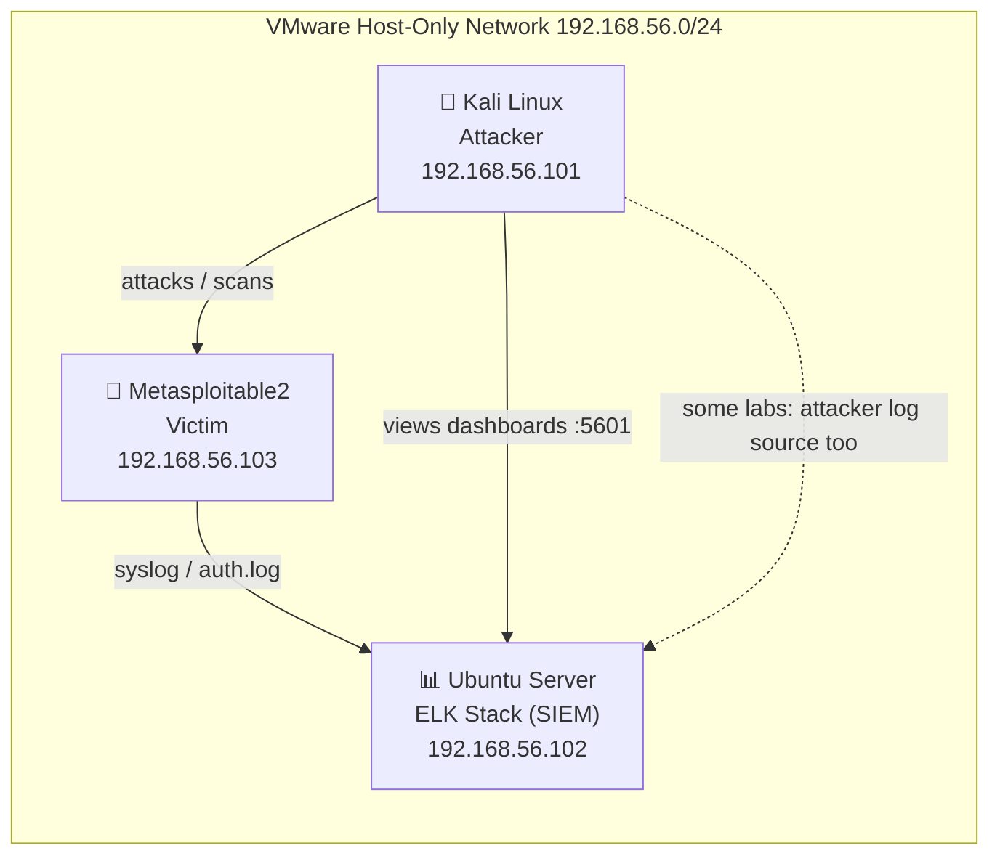

# SOC & Threat Hunting Lab Course
### From Attack Simulation to Detection Engineering — A 9-Lab Hands-On Series


## About This Course

This is a self-paced, hands-on course for anyone who wants to move from "I know what Nmap and Metasploit do" to **"I can generate an attack, see it land in a SIEM, write the detection rule, and explain the evidence like an analyst."**

Every lab follows the same loop:

**Attack → Log → Detect → Document.**

You will run real attack techniques from Kali Linux against real targets (a dedicated victim VM), watch the resulting evidence arrive in an ELK Stack SIEM, build a detection (query, alert, or dashboard) for it, and write up the finding the way a SOC analyst would.

No videos are required — every lab is fully documented in text, with exact commands, expected output, and clearly marked points where **you** capture a screenshot so the write-up has real visual evidence.

## Lab Environment Architecture

Three virtual machines, one isolated internal network:



| Machine | Role | OS | IP (this course) |
|---|---|---|---|
| Kali Linux | Attacker / red team box | Kali Rolling 2025.3 | `192.168.56.101` |
| ELK-SIEM | Log aggregation, detection, dashboards | Ubuntu Server 22.04 LTS | `192.168.56.102` |
| Metasploitable2 | Intentionally vulnerable victim | Ubuntu 8.04 (custom) | `192.168.56.103` |

> Environment build instructions (Phase 0) live in [`00-Environment-Setup/`](./00-Environment-Setup/README.md). **Do this before starting Lab 1.**
>
> **Log shipping note:** Metasploitable2 runs a 2008-era Ubuntu base too old for modern log-shipping agents (Filebeat, etc.) to run on. Labs that need its logs use its built-in classic syslog daemon (`sysklogd`, via `/etc/syslog.conf`) to forward events over UDP to port 514 on the ELK-SIEM VM, where an `iptables` rule redirects that traffic to a **Logstash** listener on port 5514 (Logstash can't bind port 514 directly without breaking Java's library loading — see Lab 1's troubleshooting section). Logstash then parses and forwards events to Elasticsearch. This is introduced in Lab 1 and reused in later labs.

## Repository Structure

```
soc-threat-hunting-course/
├── README.md                              ← you are here
├── 00-Environment-Setup/
│   ├── README.md                          ← build the 3-VM lab network + ELK
│   └── media/                             ← your screenshots for this phase
├── Lab-01-SSH-Bruteforce-Detection/
│   ├── README.md
│   └── media/
├── Lab-02-Port-Scan-Detection-Engineering/
├── Lab-03-Reverse-Shell-Network-Detection/
├── Lab-04-SOC-Investigation-Simulation/
├── Lab-05-Custom-Log-Based-IDS-Script/
├── Lab-06-Beaconing-Traffic-Detection/
├── Lab-07-Exploitation-Visibility-Analysis/
├── Lab-08-Web-Attack-Detection-SIEM/
└── Lab-09-Baseline-vs-Attack-Deviation/
```

Each lab folder is self-contained: its `README.md` is the full manual, `media/` holds only that lab's screenshots, and a `WRITEUP-TEMPLATE.md` provides a ready-to-fill investigation write-up template — kept as a separate file from the manual, so your finished write-up is its own standalone deliverable rather than embedded in the instructions.

## How Media Works in This Course

You never need to record or edit video. As you work through each lab, this course tells you exactly:
- **What to capture** (a specific terminal output, a Kibana panel, a Wireshark filter result, etc.)
- **What to name the file** (a consistent convention, e.g. `lab01-03-hydra-bruteforce-running.png`)
- **Where it goes** (which `media/` folder, and which line in that lab's `README.md` to embed it at — I'll give you the exact Markdown to paste)

Naming convention: `lab<NN>-<step-number>-<short-description>.png` (use `.gif` for anything that needs to show motion, e.g. a live dashboard updating).

## Publishing to GitHub

1. Create a new **public** GitHub repository, e.g. `soc-threat-hunting-labs`.
2. Push this folder structure as-is.
3. Add topics/tags on the repo page: `soc`, `threat-hunting`, `siem`, `elk-stack`, `detection-engineering`, `blue-team`, `cybersecurity`.
4. Pin the repo on your GitHub profile once complete — it doubles as a portfolio piece for SOC/detection-engineering job applications.
5. Optional polish once all labs are done: add a `LICENSE` (MIT is common for educational content) and a root-level architecture image (export the Mermaid diagram above as PNG via the Mermaid Live Editor if you want a static image too).

## Course Index

| # | Lab Title | Core Skill | Primary Tools |
|---|---|---|---|
| 1 | [SSH Brute-Force Detection in ELK](./Lab-01-SSH-Bruteforce-Detection/README.md) | Threshold-based alerting on auth logs | Hydra, Nmap, ELK |
| 2 | [Port Scan Detection Engineering Lab](./Lab-02-Port-Scan-Detection-Engineering/README.md) | Recon detection, false-positive tuning | Nmap, ELK |
| 3 | [Reverse Shell Network Detection Study](./Lab-03-Reverse-Shell-Network-Detection/README.md) | Packet-level C2 identification | Netcat, Metasploit, Wireshark |
| 4 | [End-to-End SOC Investigation Simulation](./Lab-04-SOC-Investigation-Simulation/README.md) | Full attack chain + incident timeline | Nmap, Metasploit, Wireshark, ELK |
| 5 | [Custom Log-Based Intrusion Detection Script](./Lab-05-Custom-Log-Based-IDS-Script/README.md) | Custom detection engineering | Python, ELK (via Filebeat/HTTP) |
| 6 | [Beaconing Traffic Detection Lab](./Lab-06-Beaconing-Traffic-Detection/README.md) | Time-series / periodicity detection | Netcat, Wireshark, ELK |
| 7 | [Exploitation Visibility Analysis](./Lab-07-Exploitation-Visibility-Analysis/README.md) | Log coverage gap analysis | Metasploit, ELK |
| 8 | [Web Attack Detection in SIEM](./Lab-08-Web-Attack-Detection-SIEM/README.md) | Web log detection engineering | Metasploit (DVWA/Mutillidae), ELK |
| 9 | [Network Baseline vs Attack Deviation Report](./Lab-09-Baseline-vs-Attack-Deviation/README.md) | Baselining & anomaly documentation | Wireshark, Nmap, ELK |

### Lab Introductions

**Lab 1 — SSH Brute-Force Detection in ELK**
Simulate a real SSH credential-stuffing attack against the victim VM using Hydra, ingest `auth.log` into ELK via Filebeat, and build a Kibana visualization plus a threshold alert that fires when failed-login velocity crosses a baseline. Goal: understand how volumetric authentication abuse looks in raw logs vs. in a SIEM, and how to tune a threshold so it catches the attack without false-alarming on normal typos.

**Lab 2 — Port Scan Detection Engineering Lab**
Run multiple Nmap scan types (`-sS`, `-sT`, `-sA`, `-sU`, `-Pn`, timing templates) against the victim and capture them on the wire and in logs. Build ELK detection logic that flags reconnaissance based on unique-port-count-per-source-per-time-window, and deliberately tune it against a "noisy but benign" traffic sample to reduce false positives. Goal: learn the tradeoff between detection sensitivity and analyst alert fatigue.

**Lab 3 — Reverse Shell Network Detection Study**
Generate multiple reverse shells (Netcat and Metasploit/`msfvenom` payloads) from the victim back to Kali, capture the traffic in Wireshark, and identify the network fingerprints of shell activity — long-lived low-volume connections, unusual destination ports, interactive-shell packet timing. Goal: learn to spot C2 channels from packet behavior alone, without relying on payload signatures.

**Lab 4 — End-to-End SOC Investigation Simulation**
Chain everything together: scan → exploit → shell → post-exploitation, captured simultaneously in Wireshark and ELK. Then produce a structured incident report with a timeline correlating each attack stage to its detection evidence (or lack of it). Goal: practice the actual SOC/IR deliverable — a timeline a Tier-2 analyst or incident commander could read cold.

**Lab 5 — Custom Log-Based Intrusion Detection Script**
Write a Python script that tails `auth.log` in real time, detects brute-force patterns using your own logic (not a SIEM query), and forwards structured JSON alerts into ELK over HTTP/Filebeat. Goal: understand detection engineering from first principles — what a SIEM's built-in correlation is actually doing under the hood — and produce a small reusable tool for your portfolio.

**Lab 6 — Beaconing Traffic Detection Lab**
Simulate periodic C2-style check-in traffic (a scripted Netcat loop) and use Wireshark statistics plus an ELK time-bucket query to detect the beacon interval, jitter, and regularity. Goal: learn interval-based/statistical detection, which catches C2 that no signature ever will.

**Lab 7 — Exploitation Visibility Analysis**
Exploit a vulnerable service on the victim (e.g. via Metasploit) and deliberately compare three views of the same event: the raw application/system log, the default ELK ingestion, and a purpose-built detection. Goal: learn to identify and articulate **monitoring gaps** — a core SOC-maturity skill that's rarely taught directly.

**Lab 8 — Web Attack Detection in SIEM**
Simulate common web attacks (SQLi, XSS, directory traversal, encoded payloads) against a vulnerable web app on the victim VM, ingest web server logs into ELK, and build detection queries for suspicious parameters, HTTP error-code spikes, and encoding anomalies (e.g. `%27`, `<script`, `../../`). Goal: extend detection engineering skills from network/auth logs into the web layer.

**Lab 9 — Network Baseline vs Attack Deviation Report**
Capture a clean traffic baseline on the lab network, then run a mix of attacks from earlier labs, and produce a before/after report documenting exactly how port usage, packet timing, and flow volume deviated from baseline. Goal: this is the "capstone" lab — it demonstrates the foundational SOC skill of knowing what *normal* looks like before you can recognize *abnormal*.

---

## Progress Tracker

- [x] Phase 0 — Environment Setup (Kali + ELK VM + Metasploitable2)
- [x] Lab 1 — SSH Brute-Force Detection in ELK
- [x] Lab 2 — Port Scan Detection Engineering Lab
- [ ] Lab 3 — Reverse Shell Network Detection Study
- [ ] Lab 4 — End-to-End SOC Investigation Simulation
- [ ] Lab 5 — Custom Log-Based Intrusion Detection Script
- [ ] Lab 6 — Beaconing Traffic Detection Lab
- [ ] Lab 7 — Exploitation Visibility Analysis
- [ ] Lab 8 — Web Attack Detection in SIEM
- [ ] Lab 9 — Network Baseline vs Attack Deviation Report
